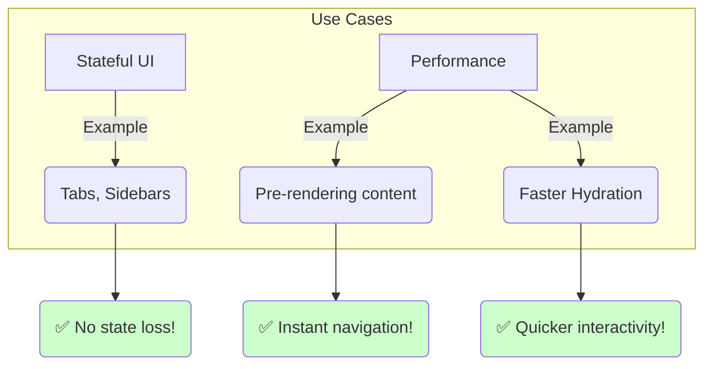

# `<Activity>` in Action: Real-World Scenarios 🎬

The theory is cool, but `<Activity>` asalu ekkada, ela mana app ni next level ki teeskelthundo chuddam. Here are some super common and powerful use cases.

### Use Case 1: State-ful Tabs 📑

Imagine you have a settings page with multiple tabs: "Profile", "Notifications", "Security". "Profile" tab lo oka pedda form undanukundam.

*   **Without `<Activity>`:** User "Profile" tab lo form fill cheyadam start chesi, "Notifications" tab ki velli, malli "Profile" ki vasthe... **form antha khali!** 😭 Endukante aa component unmount aipoindi.
*   **With `<Activity>`:** Prathi tab content ni oka `<Activity>` component lo wrap chestam. Ippudu user tabs switch chesina, prathi tab tana state ni (form input, scroll position, etc.) alane gurtupettukuntundi. Chala better experience!

**Snippet:**
```jsx
function SettingsPage() {
  const [activeTab, setActiveTab] = useState('profile');
  return (
    <>
      {/* Tab buttons... */}
      <Activity mode={activeTab === 'profile' ? 'visible' : 'hidden'}>
        <ProfileForm />
      </Activity>
      <Activity mode={activeTab === 'notifications' ? 'visible' : 'hidden'}>
        <NotificationSettings />
      </Activity>
    </>
  );
}
```

### Use Case 2: Pre-rendering for Instant UI ⚡

User experience lo "perceived performance" (ante, app entha fast ga anipistundi) chala mukhyam.

Imagine, user home page lo unnadu. Next "Dashboard" page ki velthadu ani manaki telusu. Aa Dashboard page load avvadaniki data and code kavali.

*   **Without `<Activity>`:** User "Dashboard" button click chesaka, loading spinner kanipisthundi, tarvata page vasthundi.
*   **With `<Activity>`:** Manam `App` component load ayinappude, Dashboard component ni `mode="hidden"` tho render cheyochu.

**Snippet:**
```jsx
function App() {
  return (
    <>
      <HomePage />
      {/* Dashboard ni mundhe background lo render chestunnam! */}
      <Activity mode="hidden">
        <Dashboard />
      </Activity>
    </>
  );
}
```
Deeni valla, `Dashboard` component background lo daaniki kavalsina data ni and code ni fetch cheskuni ready ga untundi. User "Dashboard" button click cheyagane, manam daani `mode` ni `'visible'` ga maristhe chalu, **adi instantly kanipisthundi!** No loading spinner! Magic! ✨

### Use Case 3: Faster Hydration 💧

Idi konchem advanced topic, but chala powerful. Server-Side Rendering (SSR) use chestunnappudu, React "hydrates" the page (ante, static HTML ni interactive React app ga marchadam).

Page lo konni parts interactive ga maradaniki time padithe, motham page unresponsive ga anipinchachu.

`<Activity>` boundaries tho, manam page ni chinna chinna independent units ga break cheyochu. Deeni valla, React oka unit ni hydrate chestunnappudu, inko unit tho user interact avvochu.

**Snippet:**
```jsx
function BlogPost() {
  return (
    <>
      <ArticleContent />
      {/* Comments section slow ga unna, Article content mundhe interactive avuthundi */}
      <Activity>
        <CommentsSection />
      </Activity>
    </>
  );
}
```
Ikkada manam `CommentsSection` ni `<Activity>` lo wrap chesam (default mode is `'visible'`). Deeni valla, comments section hydrate avvadaniki time pattina, user `ArticleContent` tho interact avvachu.



So, `<Activity>` is not just about hiding and showing. It's a powerful tool for creating sophisticated, high-performance user experiences. Ippudu ee concepts ni code lo chuddam! 💻🚀