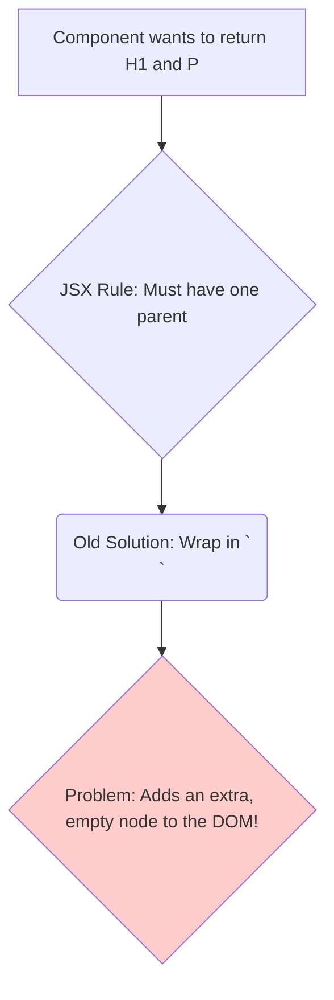

# The Problem: The Extra, Unnecessary `<div>`! 📦

Hey friend! Welcome to our first built-in component chapter: `<Fragment>`. Ee component chala simple, kani idi React lo oka chala common problem ni solve chesthundi.

## The Golden Rule of JSX

React lo oka fundamental rule undi: **A component can only return a single root element.**

Ante, nuvvu oka component nunchi rendu or ekkuva elements ni direct ga return cheyyalevu.

### ❌ The WRONG Way
Ee code neeku error isthundi: `JSX expressions must have one parent element.`

```jsx
function Post() {
  // ERROR! Can't return two elements side-by-side.
  return (
    <h1>About this blog</h1>
    <p>This is my new blog!</p>
  );
}
```

## The Old, "Div Soup" Solution

Ee problem ni solve cheyyadaniki, developers mundu ee elements anni oka extra `<div>` tho wrap chese vaallu.

```jsx
function Post() {
  // This works, but it has a problem...
  return (
    <div>
      <h1>About this blog</h1>
      <p>This is my new blog!</p>
    </div>
  );
}
```

Ee code pani chesthundi. Kani, ippudu manam DOM lo oka **anavasaramaina `<div>` ni add chesam.**

**The Problem with Extra Divs:**
*   **"Div Soup":** Manam chala components ni nest chesinappudu, mana final HTML lo chala anavasaramaina `<div>`s (`<div><div><div>...</div></div></div>`) perukoni pothayi. Idi code ni chala messy ga chesthundi.
*   **CSS Styling Issues:** Konni sarlu, ee extra `<div>` valla mana CSS (especially Flexbox or Grid layouts) correct ga pani cheyyadu.
*   **DOM Performance:** Chala pedda applications lo, anavasaramaina DOM nodes performance ni konchem thaggisthayi.



Manaki oka way kavali, ee elements ni group cheyyadaniki, kani final DOM lo aa wrapper element kanipinchakudadu.

Ee problem ki solution eh **`<Fragment>`**.

Next, manam `<Fragment>` ee "div soup" problem ni ela clean ga solve chesthundo chuddam. Ready to clean up your DOM? Let's go! 🧹➡️