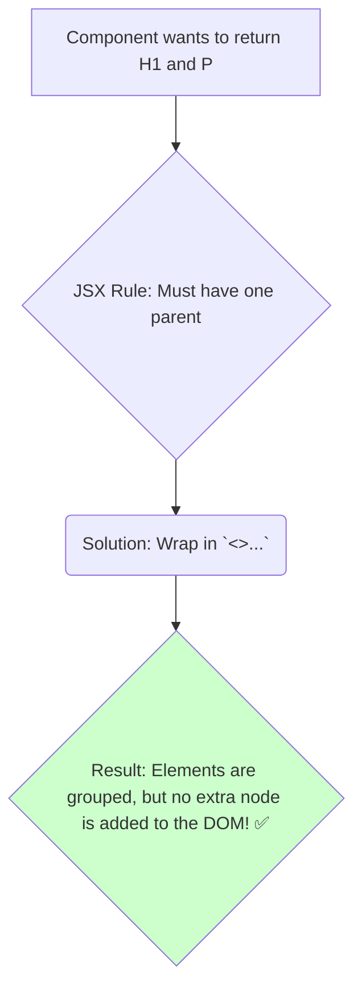

# The Solution: `<Fragment>` and its Shorthand `<>`! ✨

Manam anavasaramaina `<div>`s tho vache problem gurinchi chusam. Ee problem ki React manaki ichina simple and elegant solution eh `<Fragment>`.

## `<Fragment>` ante enti?

`<Fragment>` anedi oka built-in React component. Deeni pani okkate: multiple elements ni group cheyyadam, kani final DOM lo **никакой extra node add cheyyakunda**.

It's like an invisible wrapper.

Let's fix our previous example using `<Fragment>`:

```jsx
import { Fragment } from 'react';

function Post() {
  // Now, this is clean!
  return (
    <Fragment>
      <h1>About this blog</h1>
      <p>This is my new blog!</p>
    </Fragment>
  );
}
```

Ippudu, ee component render ainappudu, `<h1>` and `<p>` elements direct ga DOM lo add avuthayi. Vaati madhyalo or chuttu anavasaramaina `<div>` em undadu. Problem solved! 🎉

## The Shorthand Syntax: `<>`

`<Fragment>` ani prathi sari type cheyyadam konchem peddaga untundi kabatti, React manaki oka super convenient shorthand ichindi: `<>...</>`.

Idi just empty JSX tags. 99% of the time, nuvvu deenine vadathav.

```jsx
function Post() {
  // Even cleaner!
  return (
    <>
      <h1>About this blog</h1>
      <p>This is my new blog!</p>
    </>
  );
}
```

Ee code kuda paina unna `<Fragment>` code laage pani chesthundi. No extra nodes in the DOM!



## When MUST you use `<Fragment>`?

"Mari `<Fragment>` antha type cheyyadam enduku, eppudu `<>` vadacchu ga?" anukuntunnava?

Oke okka situation lo manam `<Fragment>` ni explicitly rayali: **when you need to pass a `key` prop.**

Manam oka array ni loop chesi, list of items ni render chesetappudu, prathi item ki oka unique `key` prop ivvali ani manaki telusu. Aa list items Fragments aithe, manam `<>` syntax ki key ivvalemu. Appudu manam `Fragment` ni import chesi, daaniki key ivvali.

```jsx
function Blog({ posts }) {
  return (
    <>
      {posts.map(post => (
        // Here, we need a key, so we must use the full syntax.
        <Fragment key={post.id}>
          <h2>{post.title}</h2>
          <p>{post.body}</p>
        </Fragment>
      ))}
    </>
  );
}
```

Ee okka case thappa, migatha anni situations lo, nuvvu `<>` shorthand ni happy ga use cheyyochu.

And that's it! That's everything you need to know about `<Fragment>`. A simple tool for a clean DOM.

Next, let's build a small code example to see this in action! 💻➡️