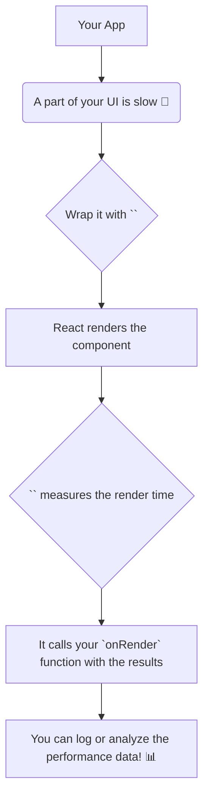

# `<Profiler>`: Mana Component ki Performance Stopwatch! ⏱️

Hey friend! Welcome to the `<Profiler>` chapter. Idi manam ippati varaku chusina components or hooks lantiది kadu. Idi oka **developer tool**.

## Asalu `<Profiler>` ante enti?

`<Profiler>` anedi oka special React component. Deeni pani UI lo emaina chupinchadam kadu. Daani pani **mana React component tree యొక్క rendering performance ni programmatically measure cheyyadam.**

Simple ga cheppalante, idi nee component ki oka stopwatch laantidi. Adi chepthundi, "Ee component and daani children render avvadaniki entha time pattindi?" ani.

**The most important thing to remember:** `<Profiler>` has **no visual output**. Adi screen meeda em kanipinchadu. Adi kevalam data ni collect chesi, manaki oka callback function dwara isthundi.

## Evari Kosam Ee Tool?

Ee component performance bottlenecks ni kanukkodaniki chala useful.
*   "Naa app lo ee specific part enduku slow ga undi?"
*   "Nenu chesina optimization (`useMemo`, `useCallback`) pani chesthunda, leda?"
*   "Ee component re-render avvadaniki entha time theeskuntundi?"

Lanti questions ki answer theluskovadaniki `<Profiler>` help chesthundi.

## Production lo Pani Cheyyadu! ⚠️

Profiling anedi konchem extra overhead (CPU and memory) add chesthundi. Anduke, by default, `<Profiler>` anedi **production build lo disabled** ga untundi.

Idi kevalam development lo performance issues ni debug cheyyadaniki matrame.

Ippudu neeku `<Profiler>` యొక్క main purpose ardham ayyindi anukuntunna.

Next, manam deenini mana code lo ela wrap cheyyalo, and daani props (`id`, `onRender`) ento chuddam. Ready to become a performance detective? Let's go! 🕵️‍♂️➡️