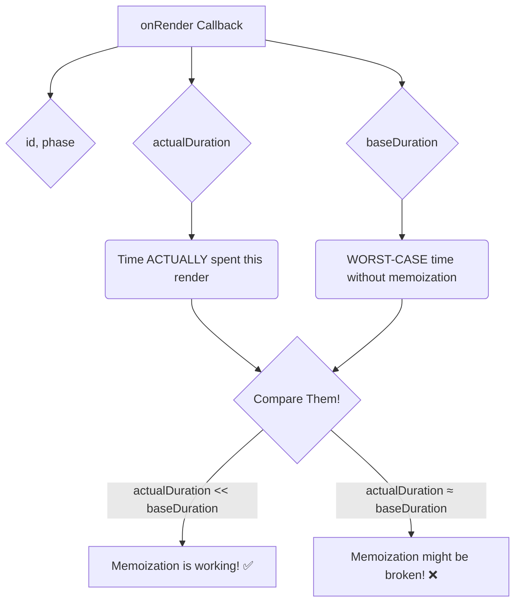

# The `onRender` Callback: Performance Data ni Ardham Cheసుకోవడం 📊

Manam `<Profiler>` ki `onRender` aney oka callback function istham ani chusam. Aa function eh mana performance detective. React daaniki chala useful information ni arguments ga pass chesthundi.

`function onRender(id, phase, actualDuration, baseDuration, startTime, commitTime) { ... }`

Let's break down each argument.

### 1. `id` (string)

*   Idi manam `<Profiler>` ki ichina `id` prop.
*   Multiple profilers unte, a profiler ee data ni pampisthundo telusukodaniki idi useful.

### 2. `phase` (string)

*   Idi ee render యొక్క "phase" ento chepthundi.
*   **`"mount"`:** The component tree was rendered for the very first time.
*   **`"update"`:** The component tree re-rendered because of a change in props, state, or hooks.
*   **`"nested-update"`:** A less common case, when a child of this Profiler tree updates, but the Profiler tree itself does not.

### 3. `actualDuration` (number)

*   Idi atni kante useful metrics lo okati.
*   Idi chepthundi: "Ee specific update kosam, `<Profiler>` and daani children render avvadaniki **nijanga entha time pattindi** (in milliseconds)."
*   Ee value, memoization (`useMemo`, `useCallback`, `React.memo`) entha baaga pani chesthundo chupisthundi. Initial mount tarvata, ee value chala thakkuva undali, endukante kevalam maarina components matrame re-render avvali.

### 4. `baseDuration` (number)

*   Idi inko useful metric.
*   Idi chepthundi: "Ee component tree antha, **никакой optimizations lekunda**, re-render avvadaniki entha time paduthundo oka andaja (in milliseconds)."
*   React ee value ni, aa tree lo unna prathi component యొక్క last render time ni sum chesi calculate chesthundi.
*   Idi oka "worst-case scenario" cost anamata.

### The Golden Comparison: `actualDuration` vs. `baseDuration`

Ee rendu values ni compare cheyyadam chala important.
*   `actualDuration` chala thakkuva ga, `baseDuration` chala ekkuva ga unte, ante nee memoization baaga pani chesthundi ani ardham! 🎉
*   `actualDuration` and `baseDuration` rendu daggara daggara ga unte, ante nee memoization sarigga pani cheyyatledu, or anavasaramaina re-renders jaruguthunnayi ani ardham. 🤔

### 5. `startTime` & `commitTime` (numbers)

*   Eevi timestamps. React ee update ni eppudu start chesindi (`startTime`), and eppudu DOM lo commit chesindi (`commitTime`) ani chepthayi.
*   Eevi multiple profilers యొక్క results ni group cheyyadaniki useful.

And that's it! Ee data tho, nuvvu nee app lo slow parts ni easy ga identify chesi, వాటిని optimize cheyyochu.

Next, let's build a small code example to see this `onRender` callback in action and log these values to the console! 💻➡️