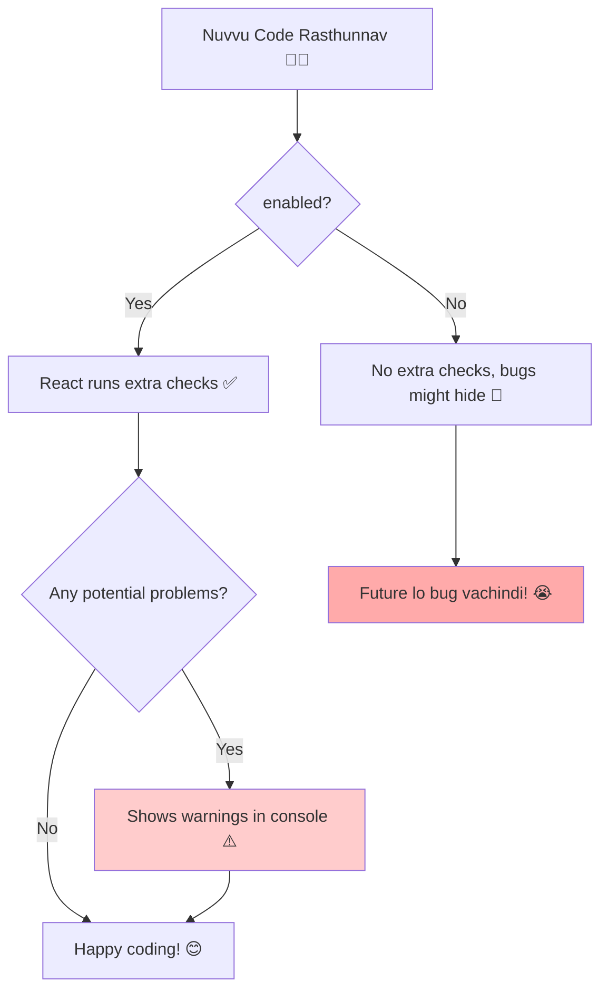

# `<StrictMode>` ante enti? 🤔

Hey friend! Mana React journey lo `<StrictMode>` ane oka special tool gurinchi matladukundam. Idi component eh kani, manaki screen meeda emi kanipinchadu. Mari deeni pani enti? 🤔

Simple ga cheppalante, `<StrictMode>` mana code lo unde **potential problems ni find cheyadaniki help chese oka strict teacher lantiది.** 👩‍🏫

Idi kevalam **development mode** lo matrame pani chesthundi. Ante, manam app ni build chesi production ki pampinappudu, deeni valla elanti performance impact undadu. So, no worries!

## Deeni Avasaram Enti?

React lo konni rules untayi (like "components must be pure"). Kani manam code rastunnappudu, teliyakundane aa rules ni break chese chances untayi. Ee chinna chinna mistakes ippudu kanipinchakapovachu, kani tarvata pedda bugs ga marachu.

`<StrictMode>` ee kindi vishayallo manaki help chesthundi:
*   **Unsafe Lifecycles:** Deprecated (pata) lifecycle methods ni use chestunte manalni warn chesthundi.
*   **Unexpected Side Effects:** Component render avuthunnappude state ni or props ni marchadam lanti panulu (side effects) chestunte, daani valla vache problems ni identify chesthundi.
*   **Legacy API Usage:** Pata (legacy) APIs, like string refs, use chestunte cheptundi.

Basically, idi manalni "Hey, ikkada edo theda ga undi, deenini ippude sari cheyyi, lekapothe future lo neeku headache avuthundi!" ani mundhe alert chesthundi.

Next, ee "Strict Teacher" ni mana app lo ela enable cheyalo chuddam. It's super easy! Ready? Let's go! 🚀