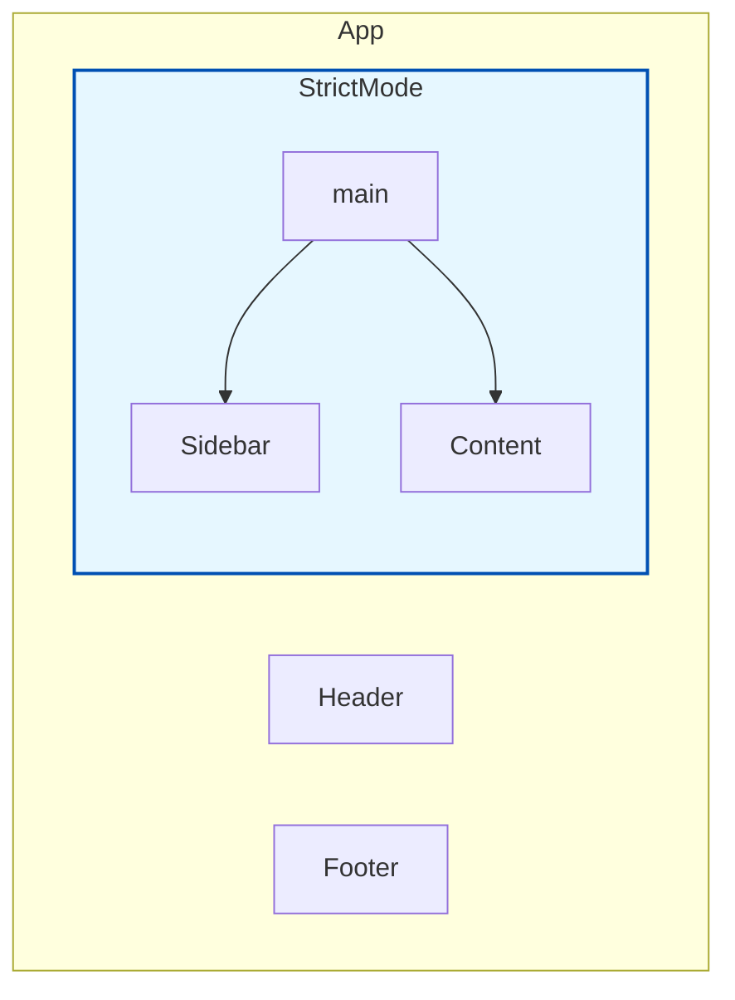

# `<StrictMode>` ni Ela Enable Cheyali? 💡

Ok, mana "Strict Teacher" gurinchi telusukunnam ga. Ippudu aa teacher ni mana class (app) loki ela teeskuravalo chuddam. Idi chala chala easy, don't worry!

Manaki rendu options unnayi:
1.  Motham App ki enable cheyadam.
2.  App lo konni specific parts ki matrame enable cheyadam.

---

### 1. Enabling for the Entire App (Recommended) ✅

Idi best approach, especially kottha projects ki. Motham app ni `<StrictMode>` tho wrap cheste, manam rase prathi component ee checks ki guri avuthundi.

`index.js` (or your main entry file) lo ila cheyali:

```jsx
// src/index.js

import React, { StrictMode } from 'react';
import { createRoot } from 'react-dom/client';
import App from './App';

const root = createRoot(document.getElementById('root'));

root.render(
  <StrictMode>
    <App />
  </StrictMode>
);
```

**Emi jarugutundi ikkada?**
*   `react` nunchi `StrictMode` ni import chesam.
*   Mana main `<App />` component ni `<StrictMode>` component tho wrap chesam.
*   Anthe! Ippudu `App` component and daani loni anni child components (motham app) Strict Mode lo run avuthayi.

---

### 2. Enabling for a Part of the App 🧩

Konni sarlu, pedda projects lo or vere team tho pani chestunnappudu, motham app ni Strict Mode lo pettadam kashtam avachu. Appudu, manam kevalam konni specific components ki matrame ee checks ni enable cheyochu.

For example, `App.js` lo `Sidebar` and `Content` components ni matrame check cheyalankunte:

```jsx
// src/App.js

import { StrictMode } from 'react';
import Header from './Header';
import Sidebar from './Sidebar';
import Content from './Content';
import Footer from './Footer';

function App() {
  return (
    <>
      <Header />
      <StrictMode>
        <main>
          <Sidebar />
          <Content />
        </main>
      </StrictMode>
      <Footer />
    </>
  );
}
```

**Emi jarugutundi ikkada?**
*   `<Header>` and `<Footer>` components meeda ee checks run avvavu.
*   `<Sidebar>`, `<Content>`, and vaati loni anni child components matrame Strict Mode lo untayi.



Chusara, entha simple o! Ippudu manam Strict Mode ni ela on cheyalo nerchukunnam. Next, asalu ee Strict Mode em em checks chesthundo, and daani valla manaki vache warnings ento detail ga chuddam. Ready for the detective work? 🕵️‍♂️➡️