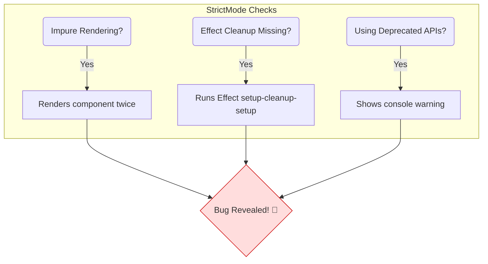

# `<StrictMode>` Em Em Checks Chesthundi? 🕵️‍♀️

Mana "Strict Teacher" mana code ni chala sharp ga observe chesthundani cheppukunnam ga. Asalu aa teacher em em vishayalanu check chesthundo ippudu chuddam.

`<StrictMode>` ee kindi key areas lo potential bugs ni pattukuntundi:

### 1. Impure Rendering (Side Effects ni Pattukuntundi) 🎨

*   **Rule:** React lo components "pure functions" la undali. Ante, same input (props, state) isthe, eppudu same output (JSX) ivvali. Render process lo vere state ni or variables ni modify cheyyakudadu.
*   **Strict Mode Check:** Ee rule ni break chestunnaremo ani check cheyadaniki, Strict Mode **development lo mee components ni rendu sarlu render chesthundi.**
*   **Enduku?** Okavela mee component impure aite (ante, render avuthunnappude edaina data ni maristhe), ee second render valla manaki a theda telisipothundi. For example, oka array lo render avuthunnappude oka item ni push chestunte, second render valla adi rendu sarlu push avuthundi. Appudu manaki bug ekkada undho easy ga ardham avuthundi.
*   *Ee "double rendering" gurinchi manam next chapter lo inka detail ga chuddam.*

### 2. Missing Effect Cleanup 🧹

*   **Rule:** Konni `useEffect` hooks lo, manam create chesina subscriptions or connections ni component unmount ayinappudu clean cheyyali (cleanup function lo). Lekapothe memory leaks avuthayi.
*   **Strict Mode Check:** Ee cleanup logic sarigga undho ledho test cheyadaniki, Strict Mode **development lo prathi Effect ni oka sari extra ga setup chesi, malli cleanup chesthundi.**
*   **Enduku?** Okavela cleanup function lekapothe or sarigga pani cheyyakapothe, ee extra cycle valla manam daanini gamanistham. For example, connection create chese effect ki cleanup lekapothe, Strict Mode valla rendu connections open avuthayi. Appudu manaki "Oh, nenu cleanup marchipoyanu!" ani strike avuthundi.

### 3. Deprecated API Usage 📜

*   **Rule:** React evolve avuthunnappudu, konni pata (legacy) APIs ni tesestharu. Vaati badulu kottha and better APIs ni use cheyyali.
*   **Strict Mode Check:** Meeru mee code lo `UNSAFE_componentWillMount` lanti deprecated lifecycle methods or `findDOMNode` lanti pata APIs ni use chestunte, console lo warning chupisthundi.
*   **Enduku?** Idi manalni future-proof code rayadaniki encourage chesthundi. Ee pata APIs future React versions lo pani cheyyakapovachu, so ippude vaatini replace cheyadam better.

Ee checks anni manalni better developers ga marchadaniki and mana apps ni inka stable ga cheyadaniki chala help chesthayi.

Ippudu, andari lo chala curiosity create chesina aa **"Double Rendering"** topic loki digipodhama? Let's find out why it's a feature, not a bug! 👇