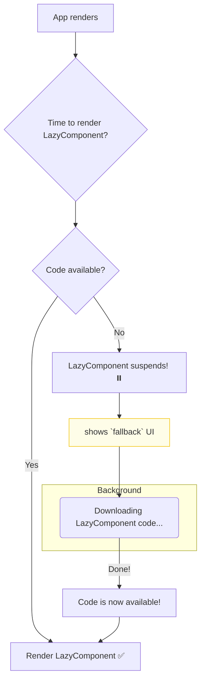

# Suspense + `React.lazy`: Supercharging Your App's Load Time ⚡

Mana app size perige koddi, JavaScript bundle size kuda peruguthundi. User app ni open chesinappudu, ee pedda bundle antha download ayye varaku wait cheyyali. Idi initial load time ni penchuthundi.

Ee problem ni solve cheyadaniki **code-splitting** ane technique undi.

> **Code-Splitting ante enti?**
> Motham code ni oke pedda file lo kakunda, chinna chinna chunks (parts) ga break cheyadam. User ki avasaramaina code chunk matrame appudu download avuthundi.

Ee code-splitting ni React lo implement cheyadaniki `React.lazy()` ane function undi.

## `React.lazy()` to the Rescue!

`React.lazy()` manam oka component ni dynamically load cheyadaniki help chesthundi. Ante, aa component avasaram ayinappudu matrame daani code download avuthundi.

**Syntax:**
```jsx
import { lazy } from 'react';

// Ee 'LazyComponent' code, adi render avvalsina time lo matrame download avuthundi.
const LazyComponent = lazy(() => import('./LazyComponent.jsx'));
```

Kani ikkada oka chinna catch undi. `LazyComponent` code network nunchi download avvadaniki konchem time paduthundi ga. Aa time lo React em chupinchali? Blank screen aa? No way!

Anduke, `React.lazy` eppudu **`<Suspense>` tho kalisi matrame pani chesthundi.**

## The Perfect Duo: `lazy` and `Suspense`

`lazy` component load avuthunna time lo, daani parent aina `<Suspense>` component tana `fallback` UI ni chupisthundi.

```jsx
import { Suspense, lazy } from 'react';
import LoadingSpinner from './LoadingSpinner.jsx';

// Component ni lazy ga import chestunnam
const LazyComponent = lazy(() => import('./LazyComponent.jsx'));

function App() {
  return (
    <div>
      <h1>My App</h1>
      <Suspense fallback={<LoadingSpinner />}>
        {/* Ee component avasaram ayinappude load avuthundi */}
        <LazyComponent />
      </Suspense>
    </div>
  );
}
```

**Flow ela untundi?**
1.  `App` component render avuthundi.
2.  React `LazyComponent` ni render cheyyalani chustundi.
3.  Kani daani code inka download kaledu. So, `LazyComponent` "suspends" (aagipothundi).
4.  Daaniki deggara unna `<Suspense>` boundary ee suspension ni pattukuni, tana `fallback` prop lo unna `<LoadingSpinner />` ni chupisthundi.
5.  Background lo, `LazyComponent` code download avuthundi.
6.  Download complete avvagane, React aa spinner ni teesi, `LazyComponent` ni render chesthundi.



Ee pattern valla, mana initial bundle size thagguthundi, and app chala fast ga load avuthundi. User ki avasaram leni code ni mundhe pampadam aapestham.

Next, `<Suspense>` ni inko powerful use case, **Data Fetching**, tho ela use chestaro chuddam! Ready to see some more magic? ✨