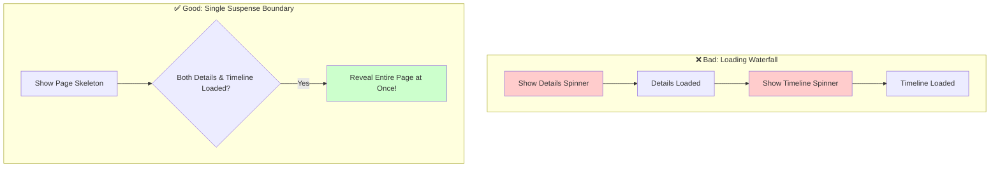

# Revealing Content Together: No More Loading Waterfalls! 🌊

Oka complex UI lo, okate sari multiple components data ni fetch cheyyalsi untundi. For example, oka user profile page lo:
*   `ProfileDetails` component (user name, bio)
*   `ProfileTimeline` component (user posts)

Ee rendu components ni separate ga load cheste, user ki emi kanipisthundi?
1.  Mundu `ProfileDetails` loading spinner.
2.  Adi load avvagane, `ProfileTimeline` loading spinner.

Idi chala jarring ga, oka "waterfall" la kanipisthundi. User experience antha bagodu.

`<Suspense>` deeniki oka super solution isthundi: **Oka single `<Suspense>` boundary lo wrap chesina anni components load ayye varaku wait chesi, anni okate sari reveal chesthundi.**

### The Power of a Single Boundary

Ee rendu components ni okate `<Suspense>` component lo pedithe chalu:

```jsx
<Suspense fallback={<ProfilePageSkeleton />}>
  <ProfileDetails />
  <ProfileTimeline />
</Suspense>
```

**Ela pani chesthundi?**
1.  React `ProfileDetails` ni render cheyadaniki try chesthundi. Adi data fetching kosam suspend avuthundi.
2.  React `ProfileTimeline` ni kuda render cheyadaniki try chesthundi. Adi kuda suspend avuthundi.
3.  Ee boundary loni **anni** components ready ayyevaraku, `<Suspense>` tana `fallback` (e.g., a single skeleton loader) ni chupisthundi.
4.  `ProfileDetails` and `ProfileTimeline` rendu data tho ready avvagane, React aa fallback ni teesi, rendu components ni **okate sari** screen meeda chupisthundi.

Ee approach valla UI chala smooth ga, professional ga anipisthundi.



### Nested Suspense for Finer Control

Kani konni sarlu, manaki inka fine control kavali. For example, "User details mundu chupinchu, adi vachaka posts load avuthu undali" anukunte.

Appudu manam **nested `<Suspense>` boundaries** ni use cheyochu.

```jsx
<Suspense fallback={<BigSpinner />}>
  <ProfileDetails />
  <Suspense fallback={<PostSkeleton />}>
    <ProfileTimeline />
  </Suspense>
</Suspense>
```

**Ee sari flow ela untundi?**
1.  Mundu `ProfileDetails` load avuthundi. Ee time lo `BigSpinner` kanipisthundi.
2.  `ProfileDetails` ready avvagane, adi screen meeda kanipisthundi.
3.  Ippudu React lopaliki velli, `ProfileTimeline` ni chustundi. Adi inka load avakapothe, daani deggara unna `<Suspense>` boundary trigger ayyi, `PostSkeleton` chupisthundi.
4.  `ProfileTimeline` ready avvagane, `PostSkeleton` poyi, actual posts kanipisthayi.

Ee pattern tho, manam user ki content ni progressively (step-by-step) reveal cheyyochu, creating a much better perceived performance.

Next, manam `useTransition` lanti hooks tho `<Suspense>` ni kalipi, inka advanced and smooth user experiences ni ela create cheyalo chuddam! Let's level up! 🚀