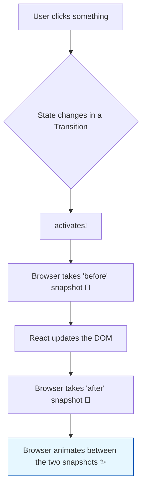

# `<ViewTransition>`: Making UI Changes Feel Like Magic! 🪄

Hey friend! Single-Page Applications (SPAs) lo manam oka view nunchi inko view ki navigate ayinappudu, UI antha suddenly maaripothundi. Content just *appears* or *disappears*. Idi konchem jarring ga, unnatural ga anipisthundi.

**The Problem:** Manam oka image gallery lo thumbnail ni click chesinappudu, aa image peddaga kanipinchali. Ee change smooth ga, oka animation la jarigithe chala baguntundi. Kani, ilaanti animations ni create cheyadam historically chala kashtam. Manam complex CSS transitions or heavy JavaScript animation libraries vaadalsi vachedi.

## The Native Solution: The View Transitions API

Ee problem ni solve cheyadaniki, modern browsers manaki **View Transitions API** ane oka super power ni isthunnayi. Ee browser-native API, DOM lo unna rendu states (pata state, kottha state) madhya smooth ga animate cheyadaniki help chesthundi.

Browser ee pani ela chesthundi?
1.  Adi pata view ni oka screenshot teeskuntundi.
2.  Kottha view ni render chesthundi.
3.  Kottha view ni kuda oka screenshot teeskuntundi.
4.  Ee rendu screenshots madhya, default ga oka nice cross-fade animation ni create chesthundi.

## React's Helper: The `<ViewTransition>` Component

Ee powerful browser API ni React lo inka easy ga use cheyadaniki, React team manaki `<ViewTransition>` ane oka component ni ichindi.

> `<ViewTransition>` is a React component that wraps the browser's native View Transitions API, making it incredibly simple to create fluid, animated transitions between different UI states.

Manam cheyalsindalla, animate avvalsina content ni `<ViewTransition>` component lo wrap cheyadame!

### ⚠️ A Very Important Note

`<ViewTransition>` anedi inka **experimental (Canary)** feature. Ante, deeni API future lo marochu and ippudu production apps lo direct ga vadakpovadame manchidi. But, it's super exciting to learn about the future of web animations!

Ippudu ee magical component ni mana code lo ela use cheyalo, and daanitho oka simple enter/exit animation ni ela create cheyalo chuddam. Ready to add some flair to your app? Let's animate! 💃🕺➡️