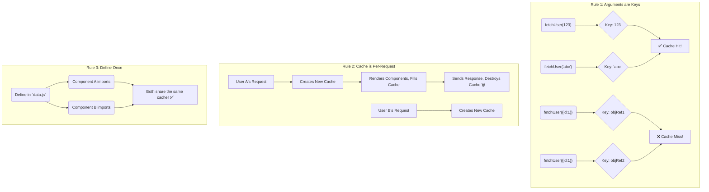

# How `cache` Works Its Magic: Under the Hood 🎩✨

`cache` chala powerful, kani adi magic kadu. Daani venakala konni simple rules unnayi. Ee rules telisthe, manam daanini inka effectively use cheyochu.

### 1. Arguments are the Key! 🔑

`cache` oka function call ni gurtupettukovali ante, daaniki oka "key" kavali kada. Adi ee key ni ekkada nunchi teeskuntundi? **The arguments you pass to the function!**

```javascript
fetchUser(123); // Here, `123` is the key
fetchProduct('abc-xyz'); // Here, `'abc-xyz'` is the key
```
`cache` ee arguments ni use chesi, internally oka map lanti structure maintain chesthundi: `Map { 123 => { user data } }`.

**The Golden Rule of Keys:** `cache` arguments ni `Object.is()` tho compare chesthundi (idi `===` ki chala similar).
*   **Primitives work perfectly:** Strings, numbers, booleans lanti primitive values tho manaki elanti problem undadu. `fetchUser(123)` will always match another `fetchUser(123)`.
*   **Objects & Arrays are tricky!** Meeru arguments ga objects or arrays pass chestunte, chala jagrattha ga undali. `cache` hit avvali ante, meeru **exact same object reference** ni pass cheyyali.

**Example of a common mistake:**
```jsx
// 🚩 WRONG: This will NOT hit the cache
function ComponentA() {
  // Ee object prathi render lo kotthadi create avuthundi
  const user = fetchUser({ id: 123 });
}

function ComponentB() {
  // Ee object kuda prathi render lo kotthadi create avuthundi
  const user = fetchUser({ id: 123 });
}
```
Ikkada, rendu objects lo oke data unna, avi memory lo veru veru objects. So, `cache` daanini veru veru keys ga teeskuni, rendu sarlu `fetchUser` ni run chesthundi.

### 2. The Cache is Short-Lived (And That's a Good Thing!) ⏳

Ee cache eppati varaku untundi? Forever? No!

> The cache created by `React.cache` is temporary. It is automatically cleared **for every single server request**.

Ante, oka user page ni request chesinappudu, React oka kottha, empty cache ni create chesthundi. Aa request render process lo anni cached functions aa cache ni use cheskuntayi. Aa request complete avvagane, aa cache antha **destroy** aipothundi.

Next user (or ade user malli) request chesinappudu, process malli kottha cache tho start avuthundi.

**Why is this good?**
*   **No Stale Data:** Prathi user ki fresh data vasthundi. Pata user request loni data inko user ki kanipinche chance eh ledu.
*   **Simple & Safe:** Manam cache ni manually clear cheyadam gurinchi alochinchalsina pani ledu. React takes care of everything.

### 3. Define It Once, Use It Everywhere ☝️

Cached function ni ekkada define cheyyali?
The best practice is to **define it in a separate file and export it**.

```jsx
// lib/data.js (✅ The Right Way)
import { cache } from 'react';

async function _fetchData(...) { ... }

export const fetchData = cache(_fetchData);
```

**Why?** Okavela meeru `cache` ni component lopalana define cheste, prathi render ki oka kottha cached function (with a new empty cache) create avuthundi. Idi `cache` main purpose ne defeat chesthundi. So, never do this!



Ippudu manaki `cache` ela pani chesthundo clear ga ardhamaindi. Next, deeni primary playground aina **React Server Components** lo idi entha powerful o chuddam! 🚀➡️