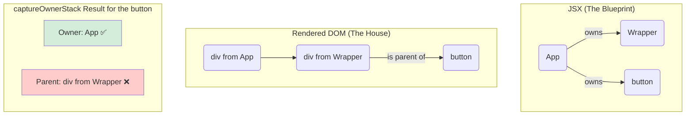

# Owner vs. Parent: The Most Important Difference! 🤔

`captureOwnerStack` gurinchi nerchukune mundu, manam aagam chesi, oka chala important concept ni ardham cheskovali: React lo **"Owner"** ki and **"Parent"** ki unna theda. Ee rendu padalu oke la anipinchina, vaati ardhalu chala veru. Ee theda telisthe ne, `captureOwnerStack` asalu pani ento manaki ardham avuthundi.

---

### Parent: Who is Above Me in the House? 🏡

**Parent** anedi chala simple concept. Final ga render ayina HTML (DOM tree) lo, oka element ki immediate ga paina unna element eh daani "parent".

**Example:**
```html
<div>  <!-- This div is the parent -->
  <p>Hello</p>
</div>
```
Ikkada, `<p>` tag ki parent evaru? The `<div>`. It's all about the final visual structure.

---

### Owner: Who Created Me in the Blueprint? 📝

**Owner** anedi konchem different concept. Idi DOM structure gurinchi kadu, JSX lo component ni evaru create chesaru anedi.

> The "owner" of a component is the component whose `render` method was responsible for creating that component instance by writing its tag in JSX.

Ee concept ni ardham cheskovadaniki best example oka "wrapper" component.

Let's look at this code:
```jsx
// A simple wrapper that adds a border
function Wrapper({ children }) {
  return <div className="wrapper">{children}</div>;
}

// Our main App
function App() {
  return (
    <Wrapper>
      <button>Click Me</button>
    </Wrapper>
  );
}
```

Ippudu, ee `<button>` gurinchi alochiddam:
*   **Who is its Parent?** The `div` with `className="wrapper"`. Final HTML lo, button aa div lopalane untundi.
*   **Who is its Owner?** **`<App>`!** Endukante, `<Wrapper>` component aa button ni create cheyyaledu. Adi kevalam `children` prop ni teeskuni, alane render chesindi. Asalu aa `<button>` ni JSX lo evaru rasaru? `<App>` component. So, `<App>` is the owner.

`captureOwnerStack` manaki ee "owner" hierarchy ni isthundi, parent hierarchy ni kadu. Endukante debugging ki ade ekkuva useful. Manaki "ee button ye div lo undi?" ani kadu, **"ee button ni page meediki teeskochhina component edi?"** ani teliyali.



Ee theda chala crucial. `captureOwnerStack` will tell you that `<App>` is responsible for the `<button>`, which is exactly the information a developer needs to debug effectively.

Ippudu ee knowledge tho, asalu `captureOwnerStack` ni code lo ela use cheyalo, and daani output ela untundo, next chapter lo chuddam! Let's get practical! 💻➡️