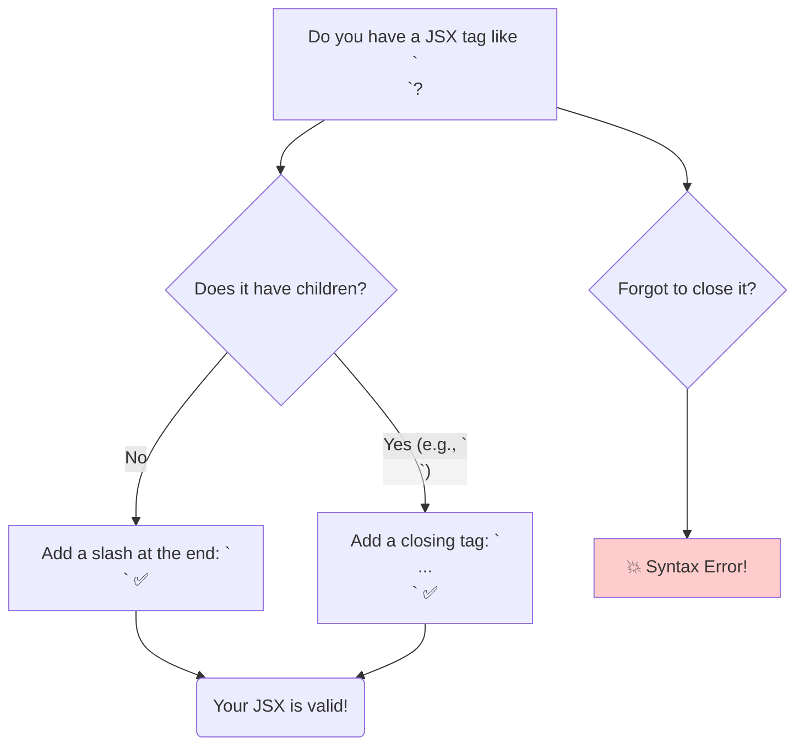

# HTML Tags in JSX: Your Basic Building Blocks 🧱

Hey friend! Manam ippudu React lo UI ni build cheyadaniki use chese most fundamental building blocks gurinchi matladukundam: **common HTML components**.

Good news entante, idi chala easy!

> React lo, meeku telisina anni standard HTML tags (`<div>`, `<p>`, `<h1>`, ``, `<button>`, etc.) ni meeru direct ga mee JSX code lo rayochu.

React, ee JSX tags ni teeskuni, vaatini real browser DOM elements ga marchi, screen meeda chupisthundi.

### It Looks Just Like HTML (Almost!)

Meeru ila simple ga rayochu:
```jsx
function MyFirstUI() {
  return (
    <div>
      <h1>Welcome to my App!</h1>
      <p>This is a paragraph.</p>
      
      <button>Click Me</button>
    </div>
  );
}
```
Idi chala varaku HTML laage undi, kada?

**Analogy: LEGO Bricks**
Imagine, browser manaki ichina HTML tags anni different shapes unna LEGO bricks anukundam. React manaki aa bricks anni isthundi, and "Ee bricks tho meeku istam vachina illu (UI) kattukondi" ani chepthundi. Manam aa bricks ni teeskuni, JSX lo assemble chestam.

### The One Important JSX Rule: Closing Tags!

HTML tho polisthe, JSX lo oka chinna kani chala strict rule undi: **Every tag must be closed.**

HTML lo, konni tags (like ``, `<br>`, `<hr>`) ki closing tag undadu. Kani JSX lo, adi mandatory.
*   Tags ni normal ga close cheyochu: `<div>...</div>`
*   Or, tag ki children lekapothe, daanini **self-close** cheyochu (tag peru tarvata `/` petti): ``

**Correct JSX:**
```jsx
// ✅ Correct: Both tags are closed.
<div>
  Hello!
  <br />
  How are you?
  
</div>
```

**Incorrect JSX:**
```jsx
// ❌ WRONG: `br` and `img` are not closed. This will cause an error!
<div>
  Hello!
  <br>
  How are you?
  
</div>
```



Okay, ippudu manaki tags ni ela rayalo telisindi. Kani, ee tags ki properties (like `class`, `style`, `onclick`) ela ivvali? React lo vaatini "props" antaru, and avi HTML "attributes" kante konchem different ga untayi. Aa theda ento, next chuddam! This is a super important topic! 👉