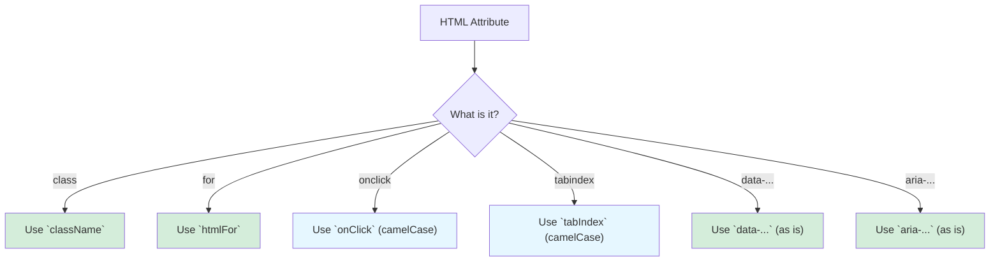

# React Props vs. HTML Attributes: The Translation Guide 📜

Hey friend! Manam HTML lo, oka tag ki extra information ivvadaniki "attributes" vadatham. For example:
`
`

React lo, ee attributes ni manam "props" (properties) ga pass chestam. Avi chala varaku oke la kanipinchina, konni chala important differences unnayi. Ee differences telusukovadam chala mukhyam, endukante JSX anedi HTML kadu, adi **JavaScript**!

### The Golden Rule: `camelCase` is King! 🐫

JavaScript lo, variable names and property names ki `camelCase` (e.g., `myVariableName`) convention vadatharu. HTML attributes lo `kebab-case` (`my-attribute`) vadatharu.

JSX, JavaScript la undadaniki try chesthundi kabatti, HTML attributes ni `camelCase` props ga marchali.

*   `onclick` in HTML becomes `onClick` in JSX.
*   `onchange` in HTML becomes `onChange` in JSX.
*   `tabindex` in HTML becomes `tabIndex` in JSX.
*   `contenteditable` in HTML becomes `contentEditable` in JSX.

### The Special Keywords: `class` and `for`

JavaScript lo, `class` and `for` anevi reserved keywords. Ante, vaatini manam variable names ga vadalemu. Ee problem ni avoid cheyadaniki, React vaatiki special names ichindi.

1.  **`class` becomes `className`**:
    *   **HTML:** `
`
    *   **JSX:** `
`

2.  **`for` becomes `htmlFor`**: (`<label>` tag tho vadathamu)
    *   **HTML:** `<label for="username">Username</label>`
    *   **JSX:** `<label htmlFor="username">Username</label>`

Ee rendu chala common ga vache mistakes, so be careful!

### The Exceptions: `data-*` and `aria-*`

Ee rule ki rendu main exceptions unnayi:
*   `data-*` attributes (custom data kosam)
*   `aria-*` attributes (accessibility kosam)

Ee rendu attributes HTML lo elaga rastamo, JSX lo kuda **alane** rayochu. Vaatiki `camelCase` avasaram ledu.

*   **HTML & JSX:** `
`

**Takeaway:** Remember `camelCase` for most props, and the special `className` and `htmlFor` for the reserved keywords.

Ippudu manam props gurinchi nerchukunnam. Kani, `style` ane oka prop undi, adi inka special. Adi oka string ni kadu, oka object ni teeskuntundi! Adento, aa special style prop gurinchi, next chapter lo chuddam. It's a key part of dynamic styling in React! 🎨➡️