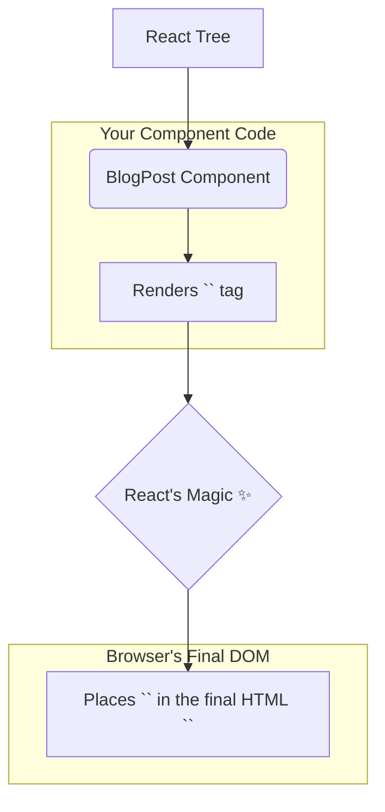

# `<link>`: Mana App ki Bayata Nunchi Assets Tucchukovadam 🔗

Hey friend! Mana website or app kevalam manam rase code tho matrame nadavadu. Daaniki chala bayata nunchi assets (sampadalu) avasaram untayi. For example:
*   **CSS Stylesheets:** Mana app ni andamga chupinchadaniki.
*   **Favicons:** Browser tab lo kanipinche chinna icon.
*   **Fonts:** Special fonts manam vadali anukunte.
*   **Preloading assets:** Performance improve cheyadaniki.

Ee bayata resources ni mana document ki "link" cheyadanike manam `<link>` component ni vadatham.

### React lo `<link>` Enduku Special?

Plain HTML lo, `<link>` tags eppudu `<head>` section lo matrame pedatham. Kani React lo, manam components tho pani chestam. Oka specific page ki matrame oka stylesheet avasaram undochu. Aa page component lone daani stylesheet ni link cheyyadam chala convenient ga untundi, kada?

React ee vishayanni ardham cheskuni, manaki oka super power isthundi:
> **Meeru `<link>` component ni mee React tree lo ekkadaina render cheyochu, React daanini automatic ga document యొక్క `<head>` section lone place chesthundi!**

Idi chala powerful feature. Deeni valla, manam component-specific dependencies ni aa component lone manage chesukovacchu.

```jsx
// BlogPost.jsx
function BlogPost() {
  return (
    <div>
      {/* Ee link automatic ga <head> loki velthundi! */}
      <link rel="stylesheet" href="/css/blog-post.css" precedence="default" />
      <h1>My Awesome Post</h1>
      <p>This post has its own styles.</p>
    </div>
  );
}
```



Kani, ee magic pani cheyyali ante, especially stylesheets kosam, manam oka kottha and important prop gurinchi telusukovali: `precedence`. Ee prop ento, and adi CSS order ni ela control chesthundo, next chapter lo chuddam. It's a key to avoiding style conflicts! Let's go! 🚀