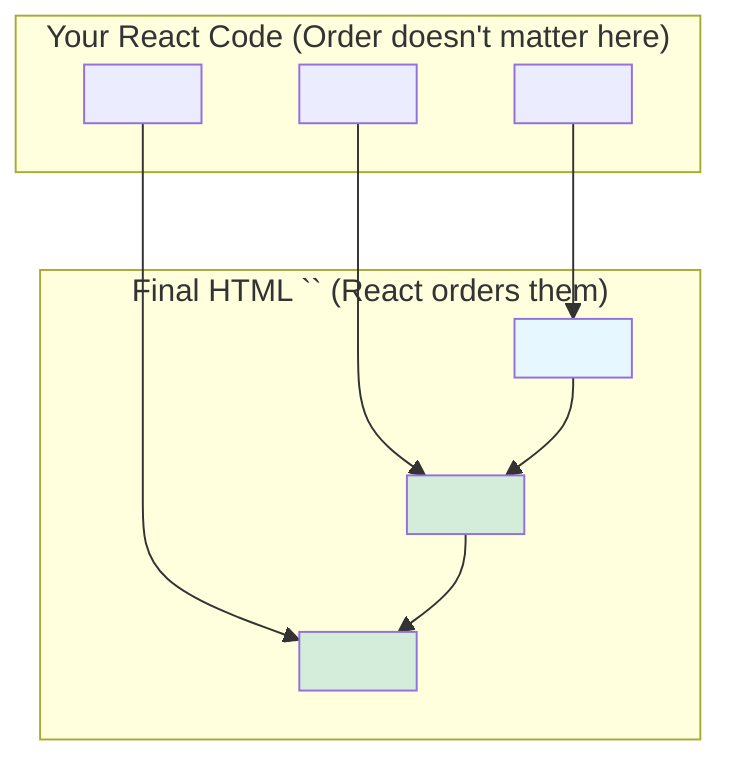

# Linking Stylesheets: The `precedence` Rule! 🥇🥈🥉

Hey friend! `<link>` component యొక్క most common use case entante, external stylesheets ni link cheyyadam. Kani, React lo idi chesetappudu, manam oka kottha rule ni follow avvali: **`precedence` prop ivvali.**

### What is `precedence`?

`precedence` ante "pradhanyatha" or "rank". Ee prop React ki chepthundi, "Ee stylesheet ni vere stylesheets tho polisthe, deeniki entha rank ivvali?" ani.

CSS lo, order chala mukhyam. Kindha unna style rule, paina unna style rule ni override chesthundi. For example:

```css
/* framework.css */
button { color: blue; }

/* component.css */
button { color: red; }
```
HTML lo `component.css` anedi `framework.css` tarvata load aithe, button color `red` ga untundi.

React lo, manam components ni ekkadaina render chestam kabatti, aa CSS file order ni maname control cheyyali. Anduke, `precedence` prop mandatory.

```jsx
// General styles for the whole app
<link rel="stylesheet" href="/framework.css" precedence="default" />

// Specific styles for a component
<link rel="stylesheet" href="/component.css" precedence="high" />
```

React `precedence` values ni chusi, final `<head>` lo vaatini order lo peduthundi. Same `precedence` unna styles anni oke chota group avuthayi.



### More Magic: Deduplication & Suspension

React stylesheets tho inko rendu magical panulu chesthundi:
1.  **Deduplication (No Duplicates):** Meeru oke stylesheet (`href` same) ni 10 different components lo render chesina, React daanini final HTML lo **oke sari** matrame include chesthundi. No more duplicate CSS files!
2.  **Suspense Integration:** Oka component render avvadaniki daani CSS file avasaram anukondi. Aa CSS file inka load avvakapothe, React automatic ga aa component rendering ni **pause (suspend)** chesthundi. CSS load ayyaka, rendering resume avuthundi. Deeni valla, user ki styles lekunda unna content (Flash of Unstyled Content - FOUC) kanipinchadu.

### Important Note:
Ee special magic antha (`<head>` placement, `precedence`, deduplication, suspension) kevalam `rel="stylesheet"` unna links ki and `precedence` prop isthe matrame apply avuthundi. Vere links ki (like `rel="icon"`) `precedence` avasaram ledu.

Ippudu, ee concepts anni - stylesheet linking, precedence, and other common uses - code examples lo chuddam! 💻✨