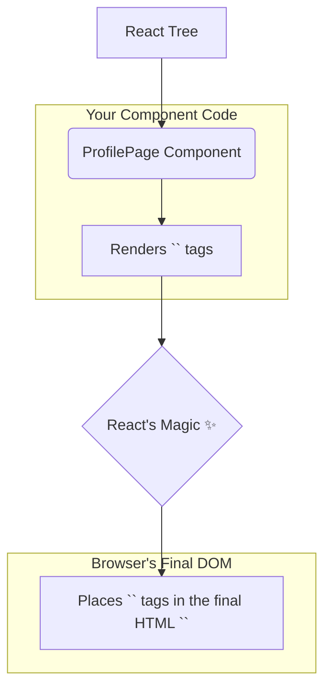

# `<meta>`: Mana Page Gurinchi "Data about Data" Ivvadam 🧠

Hey friend! Manam ippudu `<meta>` ane inko important head-management component gurinchi matladukundam.

"Meta" ante "data about data". So, `<meta>` tags mana web page gurinchi **extra information** (metadata) ni browser ki and search engines ki isthayi. Ee information user ki direct ga page lo kanipinchadu, kani background lo chala important role play chesthundi.

### `<meta>` tho manam em cheyochu?
*   **SEO (Search Engine Optimization):** Mana page description enti, keywords evi, author evaru lanti vishayalu search engines (like Google) ki cheppochu. Idi mana page search results lo better ga rank avvadaniki help chesthundi.
*   **Social Media Sharing:** Manam mana website link ni Facebook, Twitter, or WhatsApp lo share chesinappudu, adi ela kanipinchali (title, description, image) anedi control cheyyochu. Veetine "Open Graph" or "OG" tags antaru.
*   **Browser Instructions:** Page character set (`UTF-8`) ni set cheyyadam, or page ni mobile devices lo ela render cheyyalo (`viewport`) cheppadam lanti panulu cheyyochu.

### React lo `<meta>` Magic 🎩

`<link>` laage, `<meta>` kuda React lo special treatment theeskuntundi.
> **Meeru `<meta>` component ni mee React tree lo ekkadaina render cheyochu, React daanini automatic ga document యొక్క `<head>` section loki hoist chesthundi!**

Ee feature valla, prathi page daaniki sambandhinchina meta data ni ade manage cheskovacchu. For example, oka blog post page, daani specific description and keywords ni ade set cheskovacchu.

```jsx
// ProfilePage.jsx
function ProfilePage({ user }) {
  const description = `View the profile of ${user.name}.`;
  return (
    <div>
      {/* Ee meta tags automatic ga <head> loki velthayi! */}
      <meta name="description" content={description} />
      <meta property="og:title" content={`${user.name}'s Profile`} />

      <h1>Welcome to {user.name}'s profile!</h1>
      {/* ...rest of the page */}
    </div>
  );
}
```



Ee declarative approach valla, mana code inka modular ga and maintainable ga untundi.

Ippudu, ee `<meta>` tags ni different use cases (SEO, Social Media, Viewport) kosam ela use cheyalo, clear code examples tho chuddam. Let's make our pages smarter! 🤓➡️