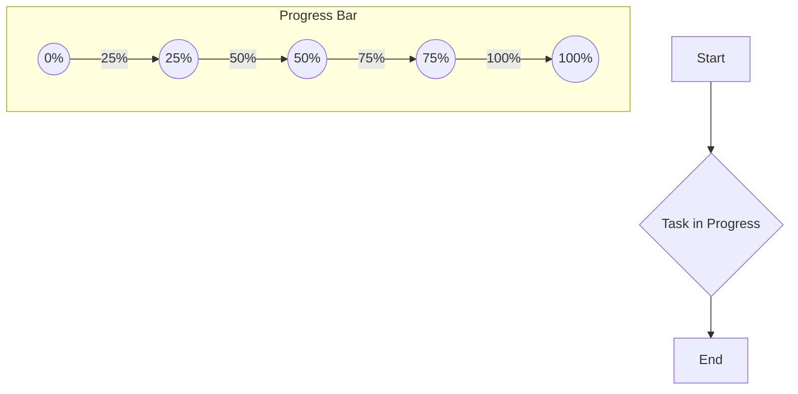

# `<progress>` Component

Namaste! Mana React documentation journey lo ee roju manam `<progress>` component gurinchi nerchukundam.

`progress` ante peru lo ne undi kada, "progress" or "munduku povadam" ani. Ee component ni manam konni operations or tasks entha varaku complete ayyayo user ki chupinchaniki use chestam.

Mermaid Diagram tho oka chinna example chuddam:



## Reference

### `<progress>`

Ee component ni render cheyadaniki, manam normal HTML `<progress>` tag ni use chestam.

```jsx
<progress value={0.5} />
```

#### Props

`<progress>` component anni [common element props](https://react.dev/reference/react-dom/components/common#common-props) ni support chestundi. Inka extra ga, ee props ni kuda support chestundi:

-   **`max`**: Idi oka number. Maximum value entha undalo specify chestundi. Default ga `1` untundi.
-   **`value`**: Idi `0` nunchi `max` madhya lo unna number. Entha pani aipoindo chupistundi. Task inka start avvakapothe or progress తెలియకపోతే, `value={null}` isthe "indeterminate" state lo untundi.

## Usage

### Controlling a progress indicator

Oka progress indicator ni chupinchaniki, `<progress>` component ni render cheyandi. Meeru `value` prop ni `0` nunchi `max` value madhya lo pass cheyochu.

```jsx
<progress value={0.5} />
```

Okavela operation inka nadusthune unte, `value={null}` isthe progress bar indeterminate state lo untundi, ante "loading..." la chupistundi.

Ee component gurinchi inka detailed examples kosam `Progress-Examples.jsx` file ni chudandi. Andulo manam different ways lo `<progress>` ni ela use cheyalo chuddam.

## Troubleshooting

### Progress bar full ga kanipistondi, kani undakudadu

Oka common mistake entante, `value` prop ni `max` prop kanna ekkuva ivvadam. Appudu progress bar eppudu full ga ne kanipistundi.

For example, `max={100}` ani petti, `value={150}` isthe, ಅದು 100% laga chupistundi. So, eppudu `value` anedi `0` nunchi `max` madhya lo undela chusukovali.

### Progress bar asalu kanipinchadam ledu

`<progress>` tag ki default styles browser batti marutayi. Konni sarlu, CSS rules valla adi kanipinchakpovachu. For example, `height` or `width` zero aipovachu. Ilantappudu, dev tools lo CSS properties check cheskondi.

Happy coding! 😊