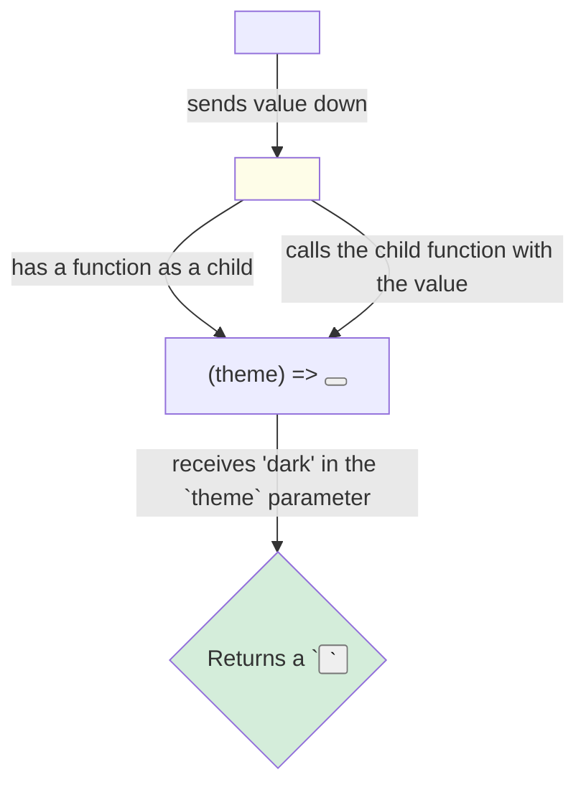

# The `<Consumer>` Component: The Legacy Way 📜

Hey friend, `useContext` hook valla ippudu context ni read cheyadam chala easy ga undi. Kani, React lo hooks ane concept raka mundu (before React 16.8), context value ni class components lo or function components lo read cheyadaniki oka veru pattern undedi.

Aa pata, legacy way eh the **`<Consumer>`** component.

`createContext()` manaki `Provider` tho paatu, `Consumer` ane inko component ni kuda isthundi: `ThemeContext.Consumer`.

## The "Render Prop" Pattern

`<Consumer>` component oka chala specific pattern ni use chesthundi, daanini **"render prop"** antaru. Idi konchem strange ga anipinchachu.

Normal ga, manam oka component ki children ga inko JSX tag ni istham:
`<Wrapper> <Button /> </Wrapper>`

Kani `<Consumer>` ki, manam child ga oka **function** ni pass cheyyali!

```jsx
// ThemedButtonWithConsumer.jsx (The Legacy Way)

import { ThemeContext } from './ThemeContext';

function ThemedButtonWithConsumer() {
  // 🟡 Legacy way (not recommended for new code)
  return (
    <ThemeContext.Consumer>
      { (theme) => <button className={theme}>I am a legacy button!</button> }
    </ThemeContext.Consumer>
  );
}
```

**What on earth is happening here?**
1.  `<ThemeContext.Consumer>` component lopalina, manam curly braces `{}` petti, oka function ni define chesam.
2.  React, ee `<Consumer>` component ni render chesetappudu, paina unna `<Provider>` nunchi context value (`'dark'` or `'light'`) ni teeskuntundi.
3.  Aa value ni, manam define chesina function ki **argument** ga pass chesthundi. (Ikkada `theme` ane parameter lo aa value vastundi).
4.  Aa function lopalina, manam aa `theme` value ni use cheskuni, manaki kavalsina JSX ni return chestam.

**Analogy: The Vending Machine**
Imagine the `<Consumer>` is a special vending machine.
*   You don't put in a coin. Instead, you give it a *recipe* (a function) that says, "Nuvvu నాకు ye drink isthe, daanini nenu ee glass lo petti istha."
*   The vending machine (`Consumer`) gets the drink (`'dark'` theme) from its storage (`Provider`).
*   It then uses your recipe (calls your function), giving it the drink (`theme` argument).
*   Your recipe runs and returns the final product (the styled button in a glass).



### Why Don't We Use It Anymore?

Ee pattern pani chesthundi, kani deenilo konni problems unnayi:
*   **Verbosity:** `useContext` tho compare cheste, idi chala ekkuva code.
*   **Nesting Hell:** Manam okate component lo multiple contexts ni consume cheyalante, `<Consumer>` ni okati lopalana inkoti nest cheyyali. Idi chala confusing ga, unreadable ga untundi.

```jsx
// Nesting Hell  nested hell 👹
<ThemeContext.Consumer>
  {theme => (
    <AuthContext.Consumer>
      {user => (
        // ... code that uses both theme and user ...
      )}
    </AuthContext.Consumer>
  )}
</ThemeContext.Consumer>
```

Anduke, `useContext` hook vachaka, ee `<Consumer>` component usage chala thaggipoindi. Kani, pata codebase lo or konni advanced library patterns lo idi inka kanipinchachu, so deeni gurinchi telusukovadam manchidi.

Ippudu, `useContext` ki and ee legacy `<Consumer>` ki madhya unna side-by-side comparison chusi, `useContext` entha better o final ga ardham cheskundam. Let's see the final showdown! 🥊➡️