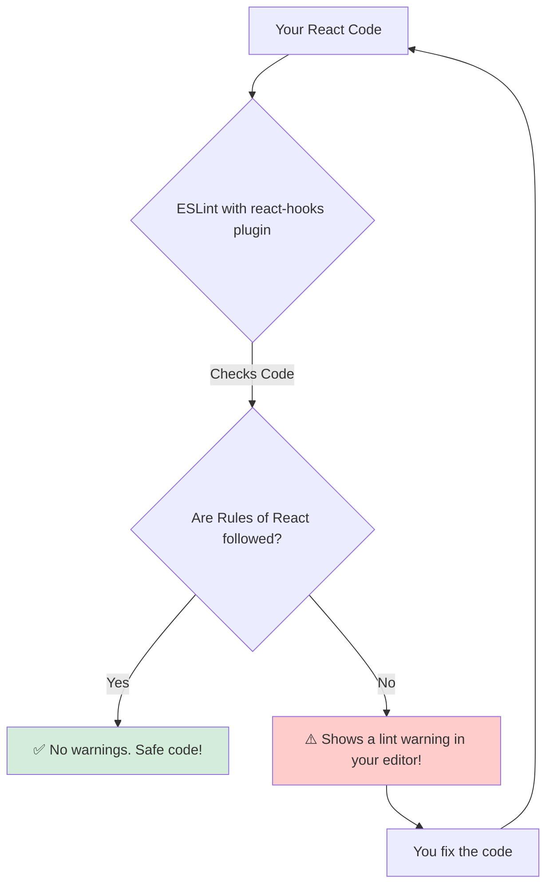

# ESLint Plugin: Mana "React Rules" ki Watchman! 👮

Hey mawa! Manam ippati varaku chala React features nerchukunnam. Kani, React lo konni fundamental rules unnayi, vaatini manam eppudu follow avvali. For example, "Hooks ni top-level lo ne call cheyyali". Ee rules ni manam "The Rules of React" antam.

Manam developers ga, konni sarlu ee rules ni marchipovacchu or teliyakunda break cheyyochu. Ala cheste, mana app lo chala weird and hard-to-find bugs vasthayi.

**The Problem:** Ee rules ni prathi developer, prathi line of code lo gurtupettukovadam chala kashtam. Manaki oka automatic "watchman" kavali, vaadu mana code ni chusi, "Hey, ikkada rule break chestunnav, sari cheyyi!" ani cheppali.

Aa automatic watchman eh **`eslint-plugin-react-hooks`**.

### What is this Plugin?

*   **ESLint:** Idi oka popular JavaScript "linter". Linter ante, mana code ni analyze chesi, potential problems, style issues, and bugs ni kanukkune oka tool.
*   **Plugin:** Manam ESLint ki extra powers ivvadaniki plugins add cheyyochu.
*   **`eslint-plugin-react-hooks`**: Idi React kosam create chesina oka special ESLint plugin. Deeni pani, manam "Rules of React" ni follow avuthunnamo ledo check cheyyadam.

> **In short, this plugin is a tool that automatically finds and warns you about common mistakes you might make when using React Hooks.**

Create React App lanti tools lo, idi by default install aypoyi untundi.

### The Two Most Important Rules It Enforces

Ee plugin lo chala rules unnayi, kani rendu chala important. Ee rendu lekunda, manam React lo code rayadam chala risky.
1.  **`rules-of-hooks`**: Hooks ni conditions lo or loops lo vadakunda chusthundi.
2.  **`exhaustive-deps`**: `useEffect` or `useMemo` lanti hooks యొక్క dependency array (`[]`) lo anni necessary variables unnayo ledo check chesthundi.

Ee plugin manaki oka safety net laantidi. Adi manalni common pitfalls nunchi save chesthundi.

Ippudu, manam a a two most important rules ni in-depth ga, "why" ane question tho ardham cheskundam. Let's start with the fundamental `rules-of-hooks`. ➡️📜