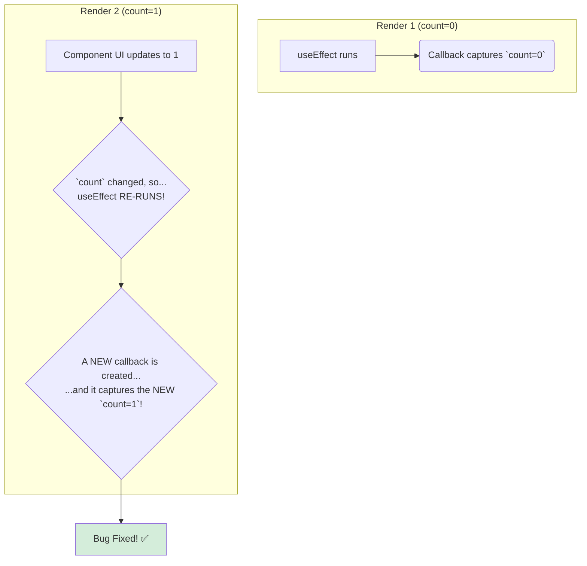

# The Solution: The Dependency Array and the Watchman 🛡️

Hey mawa! Last chapter lo manam chusina "stale closure" bug chala dangerous. Mari daanini ela solve cheyyali? The solution has two parts: the **dependency array** and the **`exhaustive-deps` lint rule**.

### 1. The Dependency Array `[]`

Manam `useEffect`, `useMemo`, or `useCallback` use chesinappudu, second argument ga pass chese array (`[]`) eh **dependency array**.

Deeni pani React ki oka simple instruction ivvadam:
> **"Hey React, ee array loni a a value maarina, nuvvu ee function ni malli kothaga create cheyyi (or ee effect ni malli run cheyyi)."**

So, mana previous example lo, manam `count` ni dependency array lo pedithe:
`useEffect(() => { ... }, [count]);`

Ippudu, prathi sari `count` state maarina, React ee `useEffect` ni malli run chesthundi. Ee kottha run lo, adi oka **kottha `setInterval` callback** ni create chesthundi. Ee kottha callback, **kottha `count` value** ni capture chesthundi.

The stale photograph is replaced with a new, updated one! Problem solved.

### 2. The Watchman: `exhaustive-deps`

Ippudu meeku anipinchovacchu, "Nenu prathi sari ee array ni correct ga fill cheyyadam ela gurtupettukovali?". Exactly! Anduke manaki `eslint-plugin-react-hooks` loni **`exhaustive-deps`** rule undi.

Ee rule oka automatic watchman laantidi. Adi mana code ni scan chesi:
> **"Meeraru `useEffect` lopaala `count` ane variable ni use chesaru, kani daanini dependency array lo pettaledu. Please add it!"**

ani manaki editor lone warning chupisthundi. Chala sarlu, adi manaki oka "quick fix" option kuda isthundi, adi automatic ga aa dependency ni add chesthundi.

Ee lint rule valla, manam accidental ga stale closures create cheyyakunda, eppudu correct and up-to-date values tho pani chestham. It's an incredibly important safety net.

Ippudu, ee "stale closure" bug ni and daani solution ni, side-by-side, oka clear code example tho chuddam. Let's see the bug and the fix in action! 💻➡️