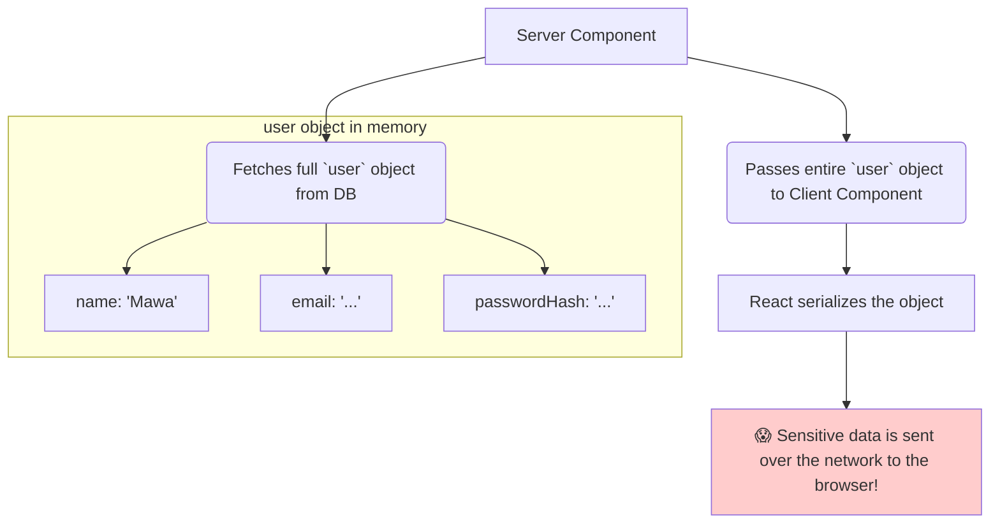

# The Problem: Leaking Server Secrets to the Client! 🤫

Hey friend! Manam ippudu React lo oka chala important topic gurinchi matladukundam: **Security**. Specifically, React Server Components (RSCs) tho pani chesetappudu vache oka pedda security risk gurinchi.

### Server Components Have Superpowers

Server Components server meeda run avuthayi kabatti, vaatiki chala superpowers untayi. Avi direct ga:
*   Database tho matladagalavu.
*   Internal APIs ni call cheyagalavu.
*   `process.env` lanti server environment variables ni access cheyagalavu.

Deeni valla, avi chala sensitive information ni teeskogalavu. For example, oka `getUser` function, database nunchi user object ni fetch chesinappudu, aa object lo ilaanti data undochu:

```javascript
const user = {
  id: 123,
  name: 'React Mawa',
  email: 'mawa@react.dev',
  passwordHash: 'a1b2c3d4e5f6....', // 😱 SUPER SENSITIVE!
  lastLoginIp: '192.168.1.1'     // 🤫 SENSITIVE!
};
```

### The Danger: The Accidental Leak

Ippudu, manam ee `user` object ni oka Server Component lo teeskuni, daanini prop ga oka Client Component ki pass cheste emavuthundi?

```jsx
// ServerComponent.jsx
import { getUser } from '@/lib/auth';
import UserInfoCard from './ClientComponent'; // This is a Client Component

export default async function UserProfile({ userId }) {
  // `user` object lo sensitive data undi
  const user = await getUser(userId);

  // 🚩 DANGER! Manam motham user object ni Client Component ki pass chestunnam!
  return <UserInfoCard user={user} />;
}
```

Client Component (`'use client'`) browser lo run avuthundi. Daaniki pass chese props anni network meeda travel chesi, browser ki reach avuthayi. Ante, manam teliyakundane aa `passwordHash` and `lastLoginIp` lanti sensitive data ni **client-side JavaScript bundle lo include chesi, pampistunnam!**

Anyone who can view the browser's network requests or the page source can potentially see this sensitive data. This is a huge security hole.

**Analogy: The "TOP SECRET" Document 📄**
Imagine, government office lo (server), oka officer (Server Component) ki "TOP SECRET" stamp unna oka full document (the `user` object) vastundi. Aa officer, aa document lo unna kevalam oka chinna public detail ni vere department ki (Client Component) pampali. Kani, mistake lo, aa officer aa chinna detail badulu, **motham "TOP SECRET" document ni Xerox teesi, pampinchesadu!** That's the data leak.



Ee accidental leaks ni aapatanike, React manaki oka special security tool isthundi. Aa tool eh **`experimental_taintObjectReference`**. Ee "TOP SECRET" stamp ni object meeda ela veyyalo, adento, next chuddam! 🛡️➡️