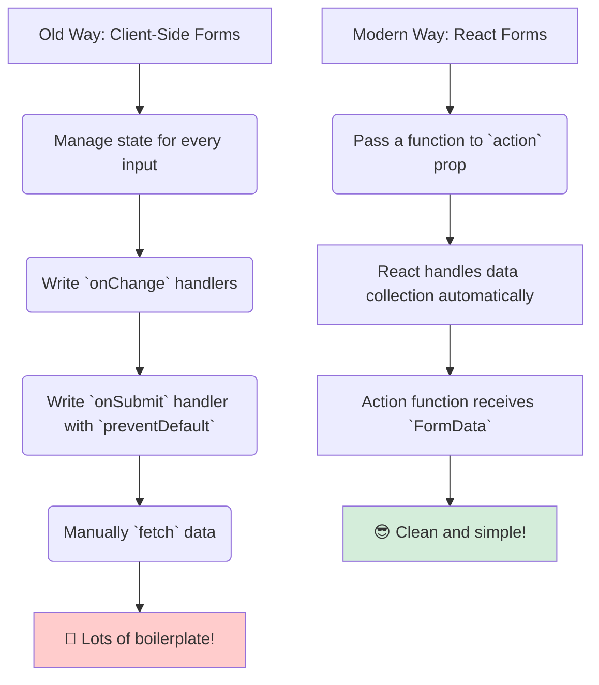

# The Modern React `<form>`: More Than Just HTML 🚀

Hey friend! Manam ippudu `react-dom` lo unna oka chala important and powerful component gurinchi matladukundam: the **`<form>`** component.

"Wait, `<form>` anedi normal HTML tag eh kada?" ani meeru anukovachu. And you are right! React lo, manam standard `<form>` tag ne use chestam.

Kani, React, especially with the introduction of **Server Actions**, has given this old, reliable tag some incredible new superpowers.

### The Old Way: The Client-Side Hassle

Mundu, manam oka form handle cheyali ante, chala client-side work undedi:
1.  Prathi input field ki `useState` tho oka state variable create cheyyali (`const [name, setName] = useState('')`).
2.  `onChange` handler rasi, user type chestunnappudu aa state ni update cheyyali.
3.  `onSubmit` function rasi, `event.preventDefault()` tho form default behavior ni aapi...
4.  ...aa function lopalana, `fetch` or `axios` tho maname manually network request pampi, data ni server ki send cheyyali.
5.  Loading and error states ni inko state variable tho manage cheyyali.

Phew! That's a lot of work for a simple form.

### The Modern React Way: Simple and Powerful

Modern React, ee process ni chala chala simple chesthundi. The biggest superpower is in the **`action` prop**.

HTML lo, `action` prop ki manam kevalam oka URL string matrame ivvagalam. Kani React lo, manam `action` prop ki direct ga oka **function** ni pass cheyochu!

> By passing a function to the `<form>`'s `action` prop, you can handle the form submission directly, often with zero client-side state management for the form data itself.

**Analogy: Regular Car vs. Smart Car 🚗**
*   **HTML `<form>`:** A regular car. Meeru destination (URL) set chesi, start chestaru. Adi aakkadiki vellipothundi (full page reload).
*   **Modern React `<form>`:** A smart, self-driving car. Meeru daaniki destination (URL) ivvochu, or direct ga "Take this package (`FormData`) and deliver it to this specific person (`action` function)" ani cheppochu. Adi lopalina navigation, traffic, anni chuskuni, pani complete chesthundi.

Ee "action function" anedi oka normal client-side function avochu, or inka powerful ga, adi oka **Server Action** (server meeda run ayye function) kuda avochu.

Ee Server Actions ento, a a`'use server'` directive ento, and avi mana form handling ni ela revolutionize chesthayo, next chapter lo chuddam. Get ready to simplify your forms like never before! ✨➡️