# How Data is Passed: The Magic of `FormData` 📋

Hey friend! Manam form `action` ki oka function ni pass cheste, adi server meeda run avuthundani chusam. Super cool!

Kani, inko magic undi. Form loni `input`, `textarea`, `select` fields lo unna data antha, aa server action ki ela telustundi? Mundu manam prathi input ki `useState` use chesi, state ni manage chesi, aa state ni `fetch` lo pampinche vallam.

With Server Actions, **you don't need to do any of that!**

> When a form with a server action is submitted, React automatically collects all the form fields into a standard **`FormData`** object and passes it as the **first argument** to your action function.

### The Key: The `name` Attribute

Ee automatic data collection pani cheyyali ante, manam oka chala important rule follow avvali: **Every input field that you want to submit must have a `name` attribute.**

Ee `name` attribute, aa input field ki oka unique key la pani chesthundi.

```jsx
<form action={myAction}>
  <label>Name:</label>
  {/* The key here is `name="username"` */}
  <input type="text" name="username" />

  <label>Email:</label>
  {/* The key here is `name="email"` */}
  <input type="email" name="email" />

  <button type="submit">Submit</button>
</form>
```

### Reading Data in the Action

Ippudu, mana server action lo, ee data ni ela read cheyyali? The action function automatically receives the `FormData` object. Manam daani meeda `.get()` method ni use chesi, `name` attribute tho, value ni teeskogalam.

```javascript
// actions.js
'use server';

export async function myAction(formData) {
  // `formData` is the object automatically passed by React.

  // We use the `name` attribute to get the value.
  const username = formData.get('username');
  const email = formData.get('email');

  console.log(`Received username: ${username}`);
  console.log(`Received email: ${email}`);

  // ... save to database ...
}
```
Anthe! No `useState`, no `onChange` handlers to manage form state, no manual object creation. React does all the heavy lifting for us.

**Analogy: Filling a Government Form**
Imagine, `<form>` anedi oka government application form.
*   Prathi input field (`<input />`) anedi aa form lo oka blank space (like "Name: _____", "Email: _____").
*   The `name` attribute is the label for that blank space ("Name", "Email").
*   Meeru form fill chesi, submit chesinappudu, clerk (`React`) aa form ni teeskuni, prathi label (`name`) pakkana unna value ni chusi, oka file (`FormData` object) lo note cheskuntadu.
*   Aa complete file ni, officer (`server action`) ki isthadu.

```mermaid
graph TD
    subgraph "Client-Side Form"
        A["<input name='username' />"] --> C{User types 'mawa'};
        B["<input name='email' />"] --> D{User types 'mawa@react.dev'};
    end

    E[User clicks Submit] --> F{React collects data};

    subgraph "FormData Object (in memory)"
        F --> G["username: 'mawa'"];
        F --> H["email: 'mawa@react.dev'"];
    end

    F --> I[Passes FormData to action function];

    subgraph "Server Action"
        I --> J["`formData.get('username')`"];
        J --> K[Returns 'mawa' ✅];
    end

    style G fill:#d4edda
    style H fill:#d4edda
```



Ee pattern valla, mana forms chala simple ga, clean ga, and maintainable ga untayi.

Ippudu ee concepts anni kalipi, `useFormStatus` tho, oka full, working example ni ela build cheyalo, next chuddam! Let's put it all together! 🧩➡️