# `<input>`: The Gateway to User Interaction ⌨️

Hey friend! Manam ippudu prathi web app ki heart lanti oka vishayam gurinchi matladukundam: **user input**. And daaniki mana main tool, the fundamental **`<input>`** component.

React lo, manam standard HTML `<input>` tag ne use chestam, kani daanini handle chese vidhanam konchem different ga, inka powerful ga untundi.

### The Two Philosophies of Handling Inputs

HTML lo, `<input>` anedi oka independent element. Adi tana value ni tane lopalana manage cheskuntundi. User em type cheste, adi browser DOM lo update aipothundi.

Kani React lo, manam state ni components lo manage chestam. So, ippudu oka question vastundi: "Who should be in charge of the input's value? The DOM or our React state?"

Ee question ki answer ga, React manaki **rendu main patterns** or "philosophies" ni isthundi:

1.  **Controlled Inputs:** Ee pattern lo, **React is the boss**. Mana component loni state, input value ki "single source of truth" ga untundi. Input lo em kanipinchali anedi complete ga React state eh decide chesthundi.
2.  **Uncontrolled Inputs:** Ee pattern lo, **the DOM is the boss**. Input tana value ni tane, traditional HTML laage, manage cheskuntundi. Manam avasaram ayinappudu matrame, DOM nunchi aa value ni "read" chestam.

**Analogy: Driving a Car 🚗**
*   **Controlled Input:** A car with a driving instructor (React). Instructor prathi second steering wheel ni, pedals ni control chestu, car ela vellalo decide chestadu. Car ki sonta control ledu.
*   **Uncontrolled Input:** A regular car. Meeru (the DOM) istam vachinattu drive cheskovachu. Avasaram ayinappudu, passenger (React) "Hey, ippudu speed entha?" ani adigi, speedometer ni chustadu.

```mermaid
graph TD
    A[React <input>] --> B{Who controls the value?};
    B -- React State --> C(Controlled Input);
    B -- The DOM --> D(Uncontrolled Input);

    C --> E[Value is driven by `value` prop and `onChange` handler];
    D --> F[Value is read when needed using a `ref`];

    style C fill:#d4edda
    style D fill:#e6f7ff
```

Ee rendu patterns ki vaati vaati use cases, advantages, and disadvantages unnayi. Ee renditini ardham cheskovadam, React lo forms ni master cheyadaniki chala crucial.

First, manam most common and recommended pattern aina **Controlled Inputs** gurinchi detail ga chuddam. Let's see how React takes control!  puppeteer➡️