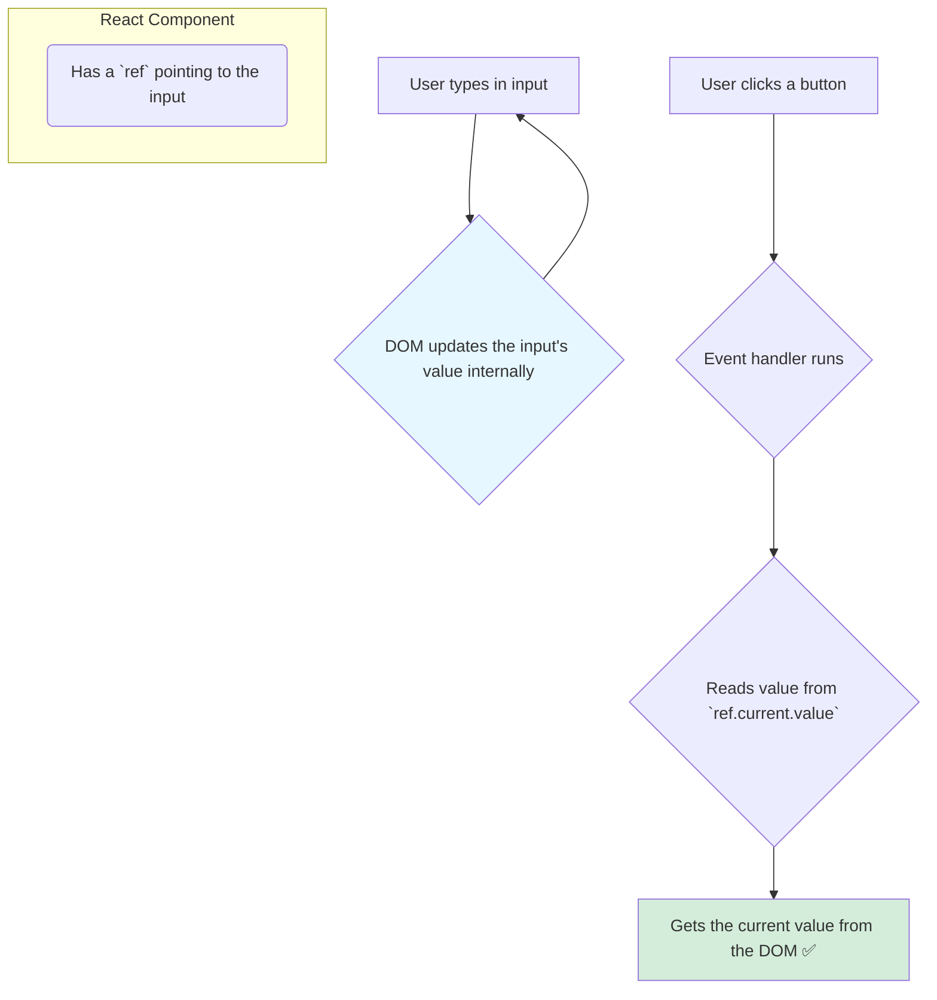

# Uncontrolled Inputs: The DOM Way 📝

Hey friend! Manam controlled inputs lo, React state eh boss ani chusam. Kani, konni sarlu, manaki antha control avasaram ledu. Simple forms lo or manam value ni kevalam submission time lo matrame theluskovali anukunnappudu, prathi keystroke ki state ni update cheyadam anedi konchem ekkuva pani anipinchachu.

Ee scenarios kosam, React manaki inko pattern isthundi: **Uncontrolled Components**.

> In the uncontrolled pattern, the **DOM itself stores and manages the input's value**. React doesn't control the value. Instead, React just "reads" the value from the DOM when it needs it.

### The Two Key Ingredients

Oka input ni uncontrolled ga use cheyadaniki, manaki rendu vishayalu kavali:
1.  **A `ref` to the DOM node:** `useRef` hook tho, manam input DOM element ki direct ga oka reference ni create chestam.
2.  **The `defaultValue` prop (optional):** Input ki oka initial value ivvali anukunte, manam `value` badulu, `defaultValue` ane prop ni vadali.

**The most important rule:** Uncontrolled input ki manam **`value` prop ni pass cheyyakudadu.**

```jsx
import { useRef } from 'react';

function UncontrolledInput() {
  // 1. Create a ref to hold the DOM node
  const inputRef = useRef(null);

  const handleSubmit = () => {
    // 3. Read the value directly from the DOM node when needed
    alert('The value is: ' + inputRef.current.value);
  };

  return (
    <div>
      {/* 2. Attach the ref to the input element */}
      <input
        ref={inputRef}
        defaultValue="Initial text" // Use this for the initial value
      />
      <button onClick={handleSubmit}>Get Value</button>
    </div>
  );
}
```

### The Data Flow: One-Way Reading

Ikkada data flow chala different ga untundi.
1.  User input field lo em type chesina, aa value ni browser loni **DOM eh direct ga update chesthundi**. React ki ee changes gurinchi emi teliyadu, and elanti re-render trigger avvadu.
2.  Manam "Get Value" button click chesinappudu, mana `handleSubmit` function run avuthundi.
3.  Aa function lopalana, manam `inputRef.current.value` tho, a a time ki DOM lo unna current value ni direct ga "read" chestam.

**Analogy: The Notepad 📝**
*   **The `<input>`:** A simple notepad on your desk.
*   **The User:** Anyone can walk up to the notepad and write on it freely. The notepad (DOM) just holds whatever is written.
*   **You (React):** You don't control what's being written. Meeru kevalam, meeku avasaram ayinappudu, aa notepad daggiriki velli, "Hey, ippudu ee notepad meeda em rasundhi?" ani chustaru (`ref.current.value`).



**Why use this pattern?**
*   **Simplicity:** Simple forms kosam, idi chala takkuva code tho pani aipothundi. No need for `useState` or `onChange` handlers for every input.
*   **Integration:** Plain JavaScript libraries or third-party libraries tho integrate chesetappudu, direct DOM access undadam valla, idi konchem easy avuthundi.

Ippudu manaki rendu patterns telusu. Mari eppudu denini vadali? A a final decision ni ela teeskovaalo, next chapter lo chuddam! 🤔➡️