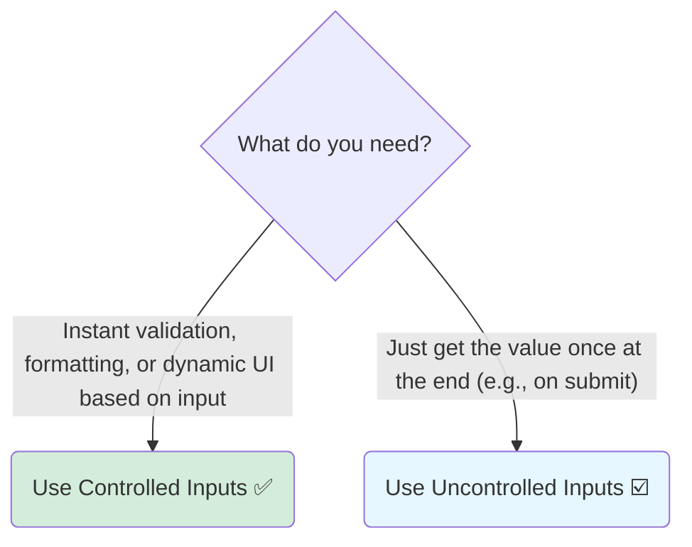

# Controlled vs. Uncontrolled: Which One to Choose? 🤔

Hey friend! Manam ippudu `<input>` ni handle cheyadaniki unna rendu powerful patterns gurinchi nerchukunnam. Ippudu asalu question: **"Denini eppudu vadali?"**

Ee decision, mee specific use case meeda depend avuthundi. There is no single "best" answer for all situations, but there are some very clear guidelines.

## Use Controlled Inputs When... ✅

General ga, **controlled components are the recommended default choice** in React. You should prefer them when:

1.  **You Need Instant Validation:** User type chestunna prathi keystroke ni validate cheyyala? (e.g., "Username must be less than 10 characters"). Controlled inputs tho, state update avvagane, meeru ventane validation logic run cheyochu.

2.  **You Have Dependent UI:** Form loni oka input value meeda, vere UI element depend ayi unda? (e.g., a "password strength" meter that updates as you type, or a "character count" display).

3.  **You Need to Enforce a Specific Format:** User ni oka specific format lo matrame type cheyyalani anukuntunnara? (e.g., credit card numbers with spaces, or phone numbers with hyphens). Controlled inputs tho, `onChange` handler lo, meeru user input ni format chesi, state ni update cheyochu.

4.  **The Submit Button Depends on Form Validity:** Form lo anni fields correctly fill cheste gani, "Submit" button ni enable cheyyakudadu anukuntunnara? Controlled inputs tho, form data antha eppudu mee state lo untundi, so ee validation cheyadam chala easy.

Basically, **if you need to "react" to the input's value on every change, use a controlled component.**

## Use Uncontrolled Inputs When... ☑️

Uncontrolled components konchem takkuva common, kani konni specific scenarios lo chala useful.

1.  **It's a "Fire and Forget" Form:** Meedi oka chala simple form aa? (e.g., a simple search bar). User em type chestunnaro madyalo meeku avasaram leda? Kevalam final ga submit chesinappudu matrame value kavala? Appudu uncontrolled input chala simple and clean ga untundi.

2.  **You are Integrating with Non-React Code:** Meeru jQuery lanti non-React library tho pani chestunnara? Aa library direct ga DOM ni manipulate cheyyalankunte, uncontrolled input (with a `ref`) tho ee integration konchem easy avuthundi.

3.  **You Want to Avoid Re-renders on Every Keystroke:** (This is less of a concern now with modern React). Oka pedda form lo, prathi keystroke ki motham form re-render avvadam performance issue anipisthe, uncontrolled inputs ee re-renders ni avoid chesthayi.

### The Final Showdown: A Comparison Table

| Feature              | Controlled Input (Puppet  puppeteer)                     | Uncontrolled Input (Notepad 📝)                           |
| -------------------- | --------------------------------------------------------- | --------------------------------------------------------- |
| **Source of Truth**  | React State (`useState`)                                  | The DOM itself                                            |
| **Data Flow**        | Two-way (State -> UI, UI -> State via `onChange`)         | One-way read (React reads from DOM via `ref`)               |
| **Best For**         | Complex forms, validation, dynamic UI                     | Simple forms, "fire-and-forget" scenarios                 |
| **Code Complexity**  | More boilerplate (`useState`, `onChange` for each input)  | Less boilerplate (often just a `ref`)                     |
| **Recommendation**   | **Generally Recommended**                                 | Use for simple cases or specific needs                    |

**Final Takeaway:** When in doubt, start with a **controlled component**. It gives you more power and flexibility. If you find that the state management is becoming unnecessarily complex for a very simple form, then you can consider switching to the uncontrolled pattern.

This concludes our deep dive into handling inputs in React. You are now a master of both controlled and uncontrolled patterns! 🎉💪