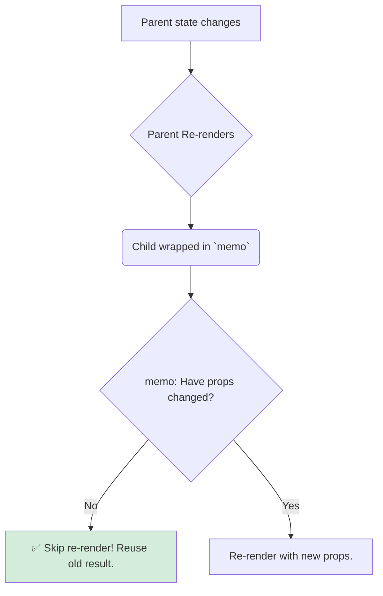

# The Solution: `React.memo`, The Smart Component Wrapper 🧠

Mana "over-eager child" (unnecessary re-render) problem ni solve cheyadaniki, React manaki `memo` ane oka super power isthundi.

`memo` anedi hook kadu, component kuda kadu. Idi oka **Higher-Order Component (HOC)**.

> A **Higher-Order Component (HOC)** is a function that takes a component as an argument and returns a *new, enhanced component*.

`memo` function, mana component ni teeskuni, daaniki oka superpower isthundi: **"If my props haven't changed, I will not re-render!"**

## How to Use `memo`

`memo` ni use cheyadam chala simple. Manam mana component function ni `memo()` lopalana petti, vachina result ni export cheyyali.

```jsx
// MemoizedChild.jsx
import { memo } from 'react';

// Original component logic is the same
function MyChild({ name }) {
  console.log(`Rendering MemoizedChild with name: ${name}`);
  return <p>Hello, smart {name}!</p>;
}

// 1. Wrap the component with memo
const MemoizedChild = memo(MyChild);

// 2. Export the new, memoized component
export default MemoizedChild;
```
Anthe! Ippudu `MemoizedChild` anedi oka "smart" component.

## The New, Efficient Workflow

Ippudu mana parent `App` component lo, `RegularChild` badulu ee `MemoizedChild` ni vadithe emavuthundo chuddam:

```jsx
// App.jsx (Parent)
function App() {
  const [count, setCount] = useState(0);

  return (
    <div>
      <button onClick={() => setCount(c => c + 1)}>
        Increment Parent Counter: {count}
      </button>
      {/* Ippudu manam mana smart child ni vadutunnam */}
      <MemoizedChild name="Mawa" />
    </div>
  );
}
```

**What happens now?**
1.  Manam button click chestam. `App` component re-render avuthundi.
2.  React, `MemoizedChild` ni chustundi. Kani ee sari, adi ventane re-render cheyyadu.
3.  `memo` lopalina unna logic trigger avuthundi. Adi `MemoizedChild` ki pass ayina kottha props ni (`{ name: "Mawa" }`) and pata props ni (`{ name: "Mawa" }`) compare chesthundi.
4.  Adi chustundi: "Hey, the props are exactly the same!"
5.  So, `memo` React ki chepthundi: **"Stop! No need to re-render this component. Just reuse the previous result."**

Result? Console lo, "Rendering MemoizedChild..." ane message kevalam first time matrame kanipisthundi. Parent `count` entha change ayina, `MemoizedChild` malli re-render avvadu. Performance saved! 🎉



Chala cool kada? Kani, ikkada oka chala important question undi. `memo` asalu aa "props are the same" ani ela decide chesthundi? Strings, numbers easy ga compare cheyochu. Kani manam props ga functions or objects pass cheste emavuthundi?

Ee "prop comparison" magic venakala unna logic ento, next chapter lo chuddam. This is where many React developers get confused, so let's make it crystal clear! 🤔➡️