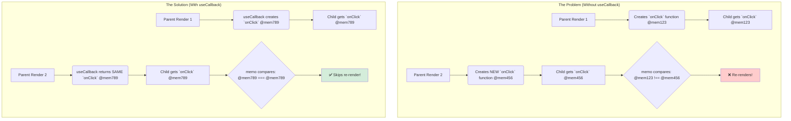

# How `memo` Compares Props: The "Shallow" Secret 🤫

Okay, `memo` anedi props marakapothe re-render ni aputhundani manaki ardhamaindi. Kani, asalu adi "props maaraledu" ani ela teluskuntundi? What is its secret?

The secret is **Shallow Comparison**.

> By default, `React.memo` does a shallow comparison of props. It loops through each prop and compares the old and new values using `Object.is()` (which is very similar to the `===` operator).

Ee shallow comparison ela pani chesthundo ardham cheskovadam chala chala important.

### Primitives (Strings, Numbers, Booleans) are Easy ✅

Primitive values tho `memo` chala happy ga pani chesthundi.
*   `'Mawa' === 'Mawa'`? Yes.
*   `42 === 42`? Yes.
*   `true === true`? Yes.

Parent re-render ayina, ee values marakapothe, `memo` correct ga re-render ni aapesthundi.

### The Big Trap: Objects and Functions 🚩

Ikkade chala mandi developers confuse avutharu. JavaScript lo, objects and functions anevi **reference types**.

**What does that mean?**
Prathi sari meeru oka object (`{}`) or oka function (`() => {}`) ni create chesinappudu, JavaScript memory lo oka **kottha** reference ni create chesthundi. Rendu objects or functions loni content oke la unna, avi memory lo veru veru places lo untayi.

Let's see the problem:
```jsx
// App.jsx (Parent)
function App() {
  const [count, setCount] = useState(0);

  // 🚩 PROBLEM: Ee function prathi App render lo KOTTHADI create avuthundi!
  const handleClick = () => {
    console.log('Button clicked!');
  };

  return (
    <div>
      <button onClick={() => setCount(c => c + 1)}>
        Re-render Parent: {count}
      </button>
      {/* Ee prop eppudu "kottha" function eh! */}
      <MemoizedChild onClick={handleClick} />
    </div>
  );
}
```

**What happens here?**
1.  `App` re-renders.
2.  A **new** `handleClick` function is created in memory.
3.  `memo` compares the props. It sees `oldProps.onClick` and `newProps.onClick`.
4.  Even though the function *code* is the same, their *references* in memory are different. So, `oldProps.onClick === newProps.onClick` is **`false`**.
5.  `memo` thinks the props have changed and **re-renders the child anyway!**

Our `memo` optimization is now completely useless! 😭

### The Solution: `useCallback` and `useMemo`

Ee "new reference" problem ni solve cheyadanike, React manaki rendu powerful hooks ichindi:
1.  **`useCallback`**: Functions kosam. Idi function definition ni re-renders madhya gurtupettukuni, manaki eppudu oke reference ni isthundi (dependencies maar నంత వరకు).
2.  **`useMemo`**: Objects and arrays kosam. Idi object ni create chesi, aa result ni re-renders madhya gurtupettukuntundi.

**The Corrected Parent:**
```jsx
// App.jsx (The RIGHT way)
import { useState, useCallback } from 'react';

function App() {
  const [count, setCount] = useState(0);

  // ✅ SOLUTION: `useCallback` tho function ni wrap chesam.
  // Ippudu, App re-render ayina, `handleClick` reference maaradu.
  const handleClick = useCallback(() => {
    console.log('Button clicked!');
  }, []); // Empty dependency array means the function is created only once.

  return (
    <div>
      <button onClick={() => setCount(c => c + 1)}>
        Re-render Parent: {count}
      </button>
      <MemoizedChild onClick={handleClick} />
    </div>
  );
}
```
Ippudu, `MemoizedChild` ki eppudu oke `handleClick` function reference velthundi, so `memo` correct ga pani chesi, re-render ni aapesthundi.



**Key Takeaway:** `memo` is powerful, but it's only as smart as the props you give it. If you pass functions or objects, you **must** memoize them with `useCallback` or `useMemo` in the parent component for `memo` to work correctly.

Ee shallow comparison manaki saripokapothe? If we need a more complex logic to decide if props are equal? Appudu `memo` second argument vastundi. Adento, next chuddam! 🕵️‍♀️➡️