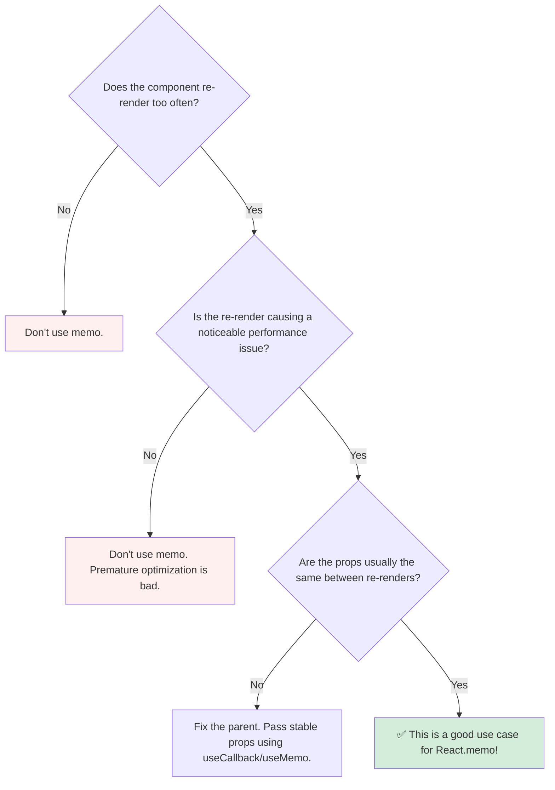

# When to Use `memo`: The Golden Rules 💡

Okay, `memo` ane oka powerful tool mana daggara undi. Ippudu manaki vache natural question: **"Should I wrap every component in `memo`?"**

The short answer: **No! Definitely not.** 🙅‍♂️

`memo` anedi oka performance optimization tool. Adi prathi problem ki solution kadu. Wrong place lo vadithe, adi code readability ni thaggisthundi, and konni sarlu negligible benefit isthundi. So, `memo` ni eppudu vadalo, eppudu vadakudadalo telusukovadam chala important.

### ✅ Use `memo` When...

1.  **The Component is "Expensive" to Render:** Mee component lopalana chala complex calculations jarugutunnaya? Leka adi chala pedda DOM tree ni generate chesthunda? Ilanti "expensive" components anavasaramga re-render avvakunda aapatam manchi idea.

2.  **It Renders Often with the Same Props:** Mee component oka busy parent lopalana unda? Aa parent state marinanduku, mee component ki same props tho frequent ga re-render avvalsina situation vastunda? This is the perfect use case for `memo`. For example, a single `ListItem` in a long list of items.

3.  **The Component is Pure:** `memo` vadali ante, mee component functionally pure ayi undali. Ante, same props isthe, eppudu same output ivvali. (This is a general React rule, but especially important for `memo`).

### ❌ Don't Bother Using `memo` When...

1.  **The Props are Always Changing:** Meeru parent lo `useCallback` or `useMemo` vadakunda, prathi render lo kottha functions or objects ni props ga pass chestunte, `memo` vadadam valla elanti use undadu. Adi eppudu re-render avuthune untundi.

2.  **The Component is Simple and Cheap:** Oka simple `div` or `p` tag ni render chese chinna component ni `memo` tho wrap cheyadam valla vache performance benefit almost zero. The cost of comparing props might even be more than the cost of just re-rendering it.

3.  **It Doesn't Re-render Often Anyway:** Mee component parent antha frequent ga re-render avvakapothe, daanini optimize cheyalsina avasarame ledu.

### The Future: The React Compiler 🤖

React team ippudu **React Compiler** ane oka kottha tool meeda pani chesthundi. Ee compiler future lo release ayinappudu, adi mana code ni chusi, ekkada memoization avasaramo, **automatic ga ade chesesthundi!**

Ante, future lo manam `memo`, `useCallback`, and `useMemo` ni manually rayalsina avasaram chala varaku thaggipothundi. The compiler will be smart enough to handle these optimizations for us. But for now, understanding these tools is crucial.

### Decision Flowchart

`memo` vadala, vadda ane decision teeskodaniki, ee simple flowchart follow avvandi:

**Final Takeaway:** Don't sprinkle `memo` everywhere. Use it thoughtfully. First, write your code without it. If you notice a performance problem, use the React DevTools Profiler to find the bottleneck component. Then, check if that component fits the criteria above, and only then, apply `memo` as a targeted solution. Happy optimizing! 🚀