# `<option>`: A Single Choice in a Big List ☑️

Hey friend! Manam ippudu chala simple, kani chala essential component gurinchi matladukundam: the **`<option>`** component.

`<option>` anedi, peru lo unnatte, oka list lo **oka single choice or option** ni represent chesthundi.

Kani, idi single ga, sontaga emi cheyyaledu. It's like a single answer on a multiple-choice question paper—it only makes sense when it's part of the whole question.

> The `<option>` component **always lives inside a `<select>` component** to create a dropdown menu.

Think of it this way:
*   `<select>` is the container, the dropdown box itself.
*   `<option>` is one of the items you can pick from that box.

### The Basic Structure

The most important prop for an `<option>` is its **`value`**. Ee `value` prop, form submit chesinappudu server ki pampinche data ni represent chesthundi. The text between the `<option>` tags is what the user sees in the dropdown.

```jsx
<select>
  {/* The user sees "Apple", but if they select it, the value "apple-123" is used. */}
  <option value="apple-123">Apple</option>
  <option value="banana-456">Banana</option>
  <option value="orange-789">Orange</option>
</select>
```

**Analogy: The Restaurant Menu 📜**
*   **`<select>`:** The menu card itself.
*   **`<option>`:** A single dish listed on the menu.
*   **Text inside `<option>` (`Apple`):** The name of the dish as written on the menu.
*   **`value` prop (`"apple-123"`):** The secret code or item number the waiter writes down to give to the kitchen. The user doesn't need to see the code, but the system needs it to know exactly what was ordered.

```mermaid
graph TD
    A["<select> (The Menu)"] --> B["<option value='apple-123'>Apple</option>"];
    A --> C["<option value='banana-456'>Banana</option>"];
    A --> D["<option value='orange-789'>Orange</option>"];

    subgraph "What the User Sees"
      B --> E[Apple];
      C --> F[Banana];
      D --> G[Orange];
    end

    subgraph "What the System Uses (on submit)"
       B --> H[apple-123];
       C --> I[banana-456];
       D --> J[orange-789];
    end

    style A fill:#e6f7ff
```



Okay, ippudu manaki `<option>` ante ento telisindi. Kani deenini asalu `<select>` tho kalipi, oka full-fledged dropdown ni ela create cheyalo, adento next chuddam! Let's build a menu! 🍽️➡️