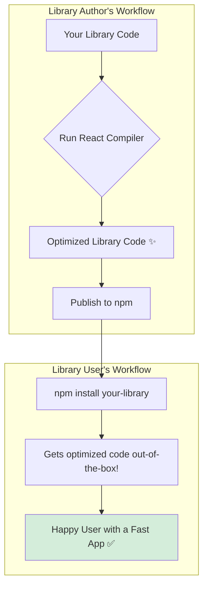

# Compiling Libraries: Why Ship Optimized Code? 🚀

Hey mawa! Manam ippativaraku React Compiler ni mana app lo ne use cheyyadam gurinchi matladukunnam. Kani, meeru oka UI library author aithe? Meeru `my-awesome-button` ane oka package ni create chesi, daanini vere developers ki isthunnaru anukondi.

Meeru mee library code ni React Compiler tho mundhe compile chesi, publish cheyyadam valla chala benefits unnayi.

### The Problem: The User's Setup is Unknown

Meeru mee library ni publish chesinappudu, daanini use chese developers a a setup vaduthunnaro manaki teliyadu.
*   Kontha mandi asalu React Compiler vadakapovacchu.
*   Kontha mandi React 18 vaduthu undochu.
*   Kontha mandi React 19 vaduthu undochu.

Manam normal code publish cheste, mana library performance antha aa user యొక్క build setup meeda aadharapaduthundi.

### The Solution: Ship Pre-Compiled Code!

The best practice is to **run the React Compiler on your library code *before* you publish it to npm.**

**Why is this better? (The "Why")**

1.  **Performance for Everyone:** Meeru mee library ni pre-compile chesthe, daanini use chese prathi okkariki optimized code anduthundi. Vaalla project lo React Compiler unna, lekapoina, vaallu mee library యొక్క performance benefits ni anubhavistharu.
2.  **Zero Configuration for Users:** Mee library users elanti extra configuration cheyyalsina avasaram ledu. Vaallu just `npm install my-awesome-button` ani chesi, use cheskovadame. The optimization is "built-in".
3.  **Consistency:** Andari users ki oke, optimized version of your code velthundi. Idi debugging ni chala easy chesthundi and unpredictable behavior ni thaggisthundi.

Kani, ee approach lo oka chinna challenge undi. Mana library React 18 and 19 rendu versions ni support chesthe? Appudu manam compiler ki correct `target` version ela cheppali? And users ki correct code ela ivvali?

Ee problem ni solve cheyadanike, manam `package.json` lo konni special configurations vadatham. Adento, next chuddam! ➡️📦