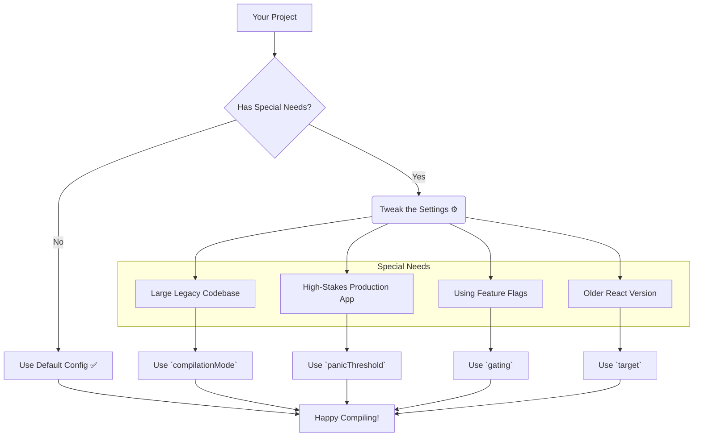

# Compiler Configuration: Why Tweak the Magic? 🤔

Hey mawa! Manam React Compiler oka super smart chef laantidi ani cheppukunnam. Adi automatic ga mana code ni optimize chesthundi. Mari, alantappudu manam daani settings ni enduku marchali? Why would we need to configure it?

The answer is simple: **Every kitchen (project) is different.** 🍳

React Compiler default settings chala projects ki perfect ga set avuthayi. Kani, konni sarlu mana project ki konni special requirements untayi. For example:
*   **A huge, old kitchen (A large legacy codebase):** Meeru compiler ni 10-year-old codebase meeda enable chestunnaru. Anni components ni oke sari optimize cheste, risk ekkuva. So, meeru compiler ni slow ga, step-by-step ga introduce cheyyali anukuntaru.
*   **A high-stakes restaurant (A critical production app):** Mee app lo chinna bug vachina, adi pedda problem avuthundi. So, meeru compiler valla build eppudu fail avvakudadu ani anukuntaru. Compiler ki emaina ardham kakapothe, adi aa component ni silent ga skip cheyyali.
*   **A kitchen with special appliances (Integrating with other tools):** Meeru compiler tho paatu vere advanced tools (like feature flags) vaduthunnaru. Compiler aa tools tho kalisi pani cheyyali.
*   **An old-style kitchen (An older React version):** Meeru inka React 18 or 17 vaduthunnaru. Compiler ki ee vishayam cheppi, daaniki thaggattu code generate cheyyamani cheppali.

Ee special situations ni handle cheyadanike, React Compiler manaki konni configuration options isthundi. Ee options manaki fine-grained control isthayi.

Ee options ni "escape hatches" la chudandi. 95% of the time, default settings eh best. Kani aa 5% special cases lo, ee options manalni save chesthayi.

Ippudu, manam prathi option ni, daani వెనకాల unna "why" ni inka deep ga, real-world scenarios tho ardham cheskundam. Let's start with `compilationMode`. ➡️