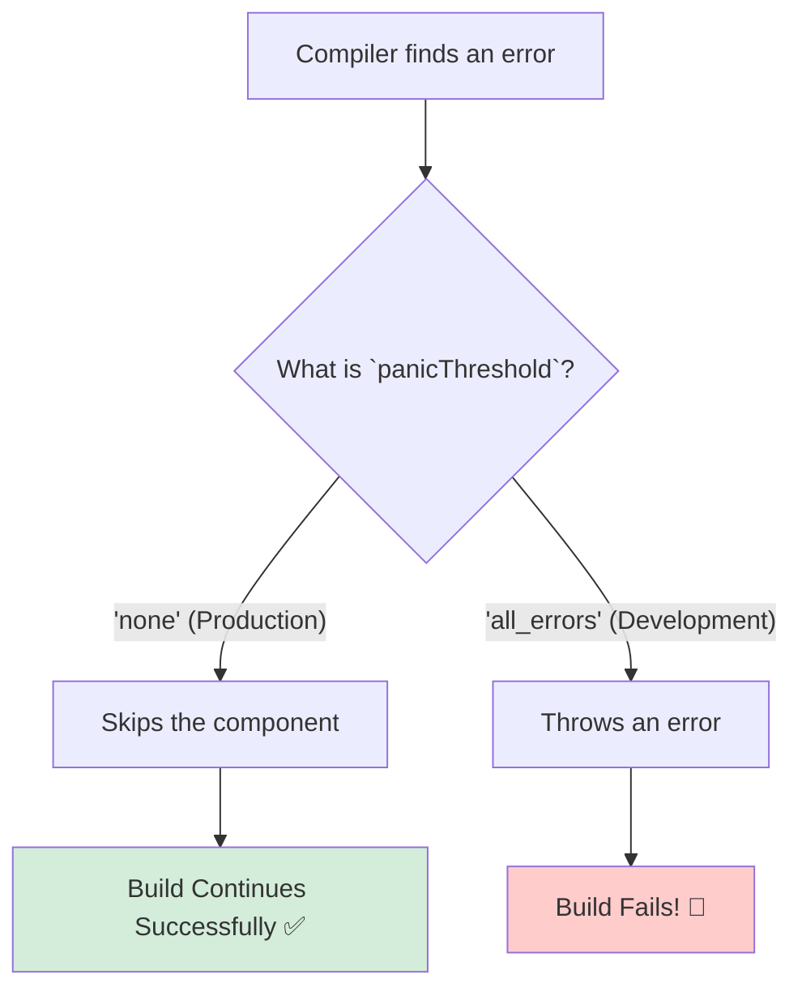

# `panicThreshold`: "Error Vaste Em Cheyyali?" 🚦

Hey mawa! Manam `logger` tho compiler errors ni ela chudalo nerchukunnam. Ippudu, aa error vachinappudu asalu em jaragali? Build antha aagipovala? Leka, aa okka component ni vadilesi munduku vellala?

Ee behavior ni control cheyyadanike, manam `panicThreshold` option ni vadatham. Deeni peru cheppinatte, idi compiler యొక్క "panic" level ni set chesthundi.

### What does `panicThreshold` do?

> **`panicThreshold` tells the compiler how to react when it finds code that it cannot understand or optimize. Should it "panic" and stop the build, or should it just skip the problematic component and continue?**

### The Modes and "Why" to Use Them

1.  **`'none'` (the default and recommended for production)**
    *   **What it does:** If the compiler finds an error in a component, it silently **skips** that component (it won't be optimized) and continues with the rest of the build. The build will **never fail** because of a compiler error.
    *   **Why use it? (The "Why"):** This is the **safest** option for production. Imagine, oka developer edo chinna mistake chesi, code push chesaru. Aa code valla compiler ki problem vachindi. `panicThreshold` `'error'` ga unte, mee entire production deployment (build) fail aipothundi! Adi pedda disaster. But with `'none'`, compiler aa okka problematic component ni vadilesi, migatha app antha optimize chesi, build ni success chesthundi. **Your site never goes down because of a compiler issue.**

2.  **`'critical_errors'` or `'all_errors'`**
    *   **What it does:** If the compiler finds an error, it immediately **throws an error and stops the build process**. Your build will fail.
    *   **Why use it? (The "Why"):** Ee modes ni manam **only development lo** vadali. Development lo unnapudu, manaki compiler errors ventane teliyali. Build fail aithe, developer "Oh, nenu rasina code lo edo problem undi, compiler ki adi nachatledu" ani ventane chusi, fix chestaru. It helps enforce good coding practices and ensures that all new code is compatible with the compiler.

### The Perfect Setup: Environment-Based Configuration

The best practice is to set this option based on the environment:

```javascript
// babel.config.js
const isDevelopment = process.env.NODE_ENV === 'development';

module.exports = {
  plugins: [
    [
      'babel-plugin-react-compiler',
      {
        // Development lo strict ga undu, Production lo safe ga undu.
        panicThreshold: isDevelopment ? 'all_errors' : 'none',
      },
    ],
  ],
};
```



Ee option tho, manam development lo quality maintain chesthu, production lo stability ni guarantee cheyyochu.

Next, manam final option, `target`, gurinchi matladukundam. Adi compiler ki "Nenu a a React version kosam code rayali?" ani chepthundi. ➡️🎯