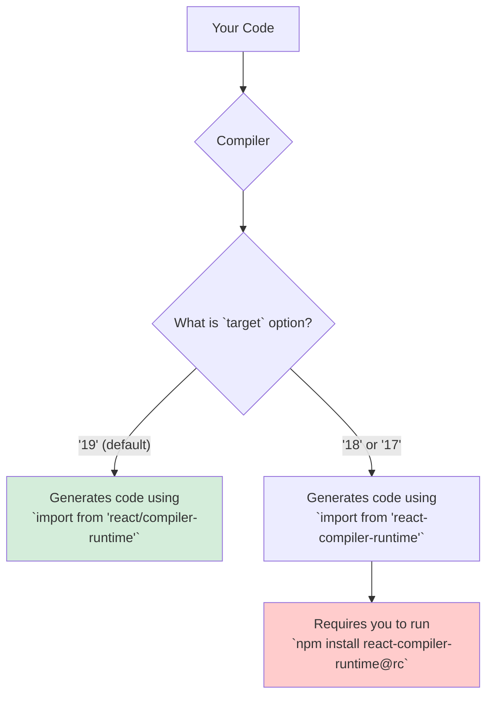

# `target`: "Which React Version Are We Building For?" 🎯

Hey mawa! Manam ippudu final configuration option gurinchi matladukundam: `target`. Ee option chala simple, kani chala important.

React Compiler mana code ni rewrite chesinappudu, adi konni special helper functions ni use cheskuntundi. Ee helper functions ni "compiler runtime" antaru.

The problem is, ee "runtime" anedi React versions madhyalo maaruthundi.

### What does `target` do?

> **The `target` option tells the compiler which version of React you are using, so it knows which runtime helpers to use.**

### The "Why" Behind Different Targets

1.  **`'19'` (the default):**
    *   **Why:** React 19 lo, the compiler runtime anedi **built-in**. Ante, adi React lone include aypoyi untundi. So, compiler generate chese code direct ga `'react/compiler-runtime'` nunchi import cheskovacchu. Most new projects ee category loki vasthayi.

2.  **`'18'` or `'17'`:**
    *   **Why:** Pata React versions (17 and 18) lo, ee runtime built-in ga ledu. So, manam daanini **separate ga install** cheyyali. Ee separate package peru `react-compiler-runtime`. Manam `target` ni `'18'` or `'17'` ga set chesinappudu, compiler ki "Hey, nenu pata version lo unnanu, so nuvvu code ni `react-compiler-runtime` package nunchi import cheyyi" ani chepthunnam.

**Analogy: The Power Adapter 🔌**
*   **React 19:** Oka brand new laptop laantidi. Daaniki universal USB-C port (built-in runtime) untundi.
*   **React 18:** Oka pata laptop laantidi. Daaniki oka special, proprietary charging port untundi. So, daanini charge cheyyadaniki, manaki oka separate adapter (`react-compiler-runtime` package) kavali.

`target` option tho, manam compiler ki a a laptop ki a a adapter vadalo chepthunnam.

**The key takeaway:**
> **Set the `target` to match your project's major React version to ensure the compiler generates compatible code.**

Ee options anni manaki React Compiler meeda complete control isthayi. Ippudu, ee configurations anni oka real-world example file lo ela kanipisthayo chuddam! ➡️📄