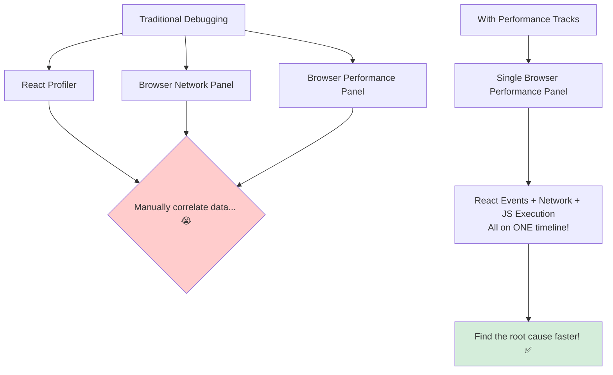

# Performance Tracks: React App ki "ECG Report" 🩺

Hey mawa! Manam ippati varaku React app lo performance issues ni debug cheyyadaniki React DevTools loni "Profiler" tab vaduthu vacham. Adi manaki component render times gurinchi chepthundi, correct eh.

Kani, oka React app performance anedi kevalam component render time meeda matrame aadharapadadu. Network requests, JavaScript execution, browser painting... ila chala vishayalu untayi.

**The Problem:** Ee vishayalu anni veru veru places lo untayi. React Profiler lo component data, Browser DevTools loni "Network" tab lo network data, "Performance" tab lo JS execution data... Ee anni kalipi chusthe gani, manaki full picture ardham kadu.

Ee problem ni solve cheyadanike, React team oka kottha, experimental feature ni introduce chesindi: **React Performance Tracks**.

### What are Performance Tracks?

> **React Performance tracks are special, React-specific timelines that appear directly inside your browser's main "Performance" panel. They visualize React's internal events alongside all other browser events.**

Idi mana app ki oka "ECG" (Electrocardiogram) laantidi. Doctor ki ECG report lo heart beats, rhythm, anni oke chota ela kanipisthayo, manaki kuda React events, network events, and browser events anni oke timeline meeda kanipisthayi.

### Why is this a Big Deal?

Ee integrated view valla, manam ilanti complex questions ki easy ga answer cheyyochu:
*   "Naa component render avvadam enduku slow ga undi? Adi oka network request kosam wait chesthunda?"
*   "Nenu button click chesinappudu, `useTransition` start ayyindi, kani aa time lo vere a a heavy JavaScript functions run avuthunnayi?"
*   "Naa `<Suspense>` fallback entha sepu kanipinchindi? Aa time lo a a data load ayyindi?"

**Important Note:** Ee feature inka **experimental** and only works in browsers that support the Performance Panel extensibility API (like Chrome, Edge, etc.).

Ippudu, ee tracks lo a a different types unnayo, and vaatini ela chadhavalo, next chuddam. Let's become performance detectives! 🕵️‍♂️➡️