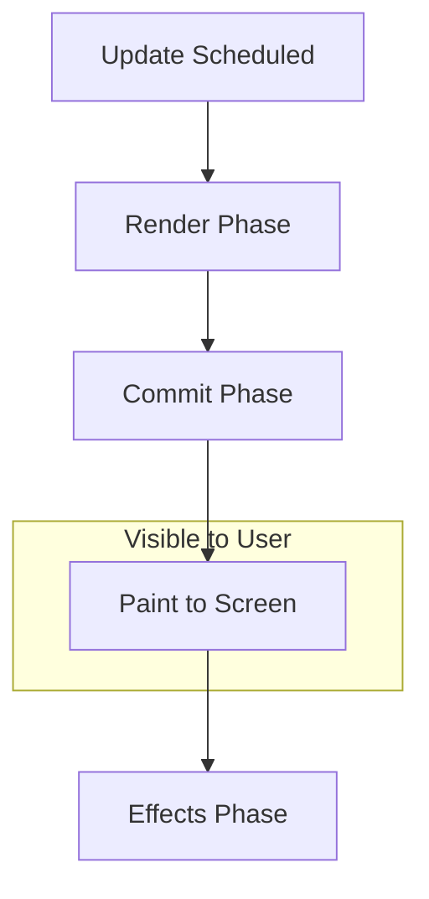

# The Scheduler Track: React Loni Pani Ela Jarugutundi? 🕒

Hey mawa! Performance Panel lo manaki kanipinche most important React track "Scheduler". Ee track, React loni internal "task manager" (Scheduler) em chesthundo, and a a panulaki entha priority isthundo chupisthundi.

Idi manaki React rendering process యొక్క full story ni chepthundi.

### The Four Priority Lanes

Scheduler track lo manaki nalugu main sub-tracks (lanes) untayi. Prathi lane oka rakamaina priority unna panulani represent chesthundi.

1.  **Blocking:**
    *   **Em chesthundi:** Ee lane lo unna panulu chala high-priority. Ee panulu ayyevaraku, user inko pani cheyyaledu.
    *   **Example:** User oka button click chesinappudu or input lo type chesinappudu, aa state update anedi "blocking" ga untundi. UI ventane update avvali.

2.  **Transition:**
    *   **Em chesthundi:** Ee lane lo unna panulu non-urgent. Ee panulu background lo jaruguthu untayi, and UI eppudu responsive ga untundi.
    *   **Example:** `useTransition` or `startTransition` tho wrap chesina state updates ee lane lo kanipisthayi.

3.  **Suspense:**
    *   **Em chesthundi:** `<Suspense>` ki sambandhinchina panulu ee lane lo untayi.
    *   **Example:** Oka component suspend ayinappudu, fallback chupinchadam, and tarvata content ready ayyaka daanini reveal cheyyadam lanti events ikkada chudochu.

4.  **Idle:**
    *   **Em chesthundi:** Ee lane lo unna panulu lowest priority. Browser em pani cheyyakunda khaali ga unnapudu matrame, React ee panulani chesthundi.

### The Lifecycle of a Render Pass

Ee priority lanes lo, manam prathi render pass యొక్క lifecycle ni chudochu. Prathi render ki konni phases untayi:
*   **Update:** Render enduku trigger ayyindo chepthundi (e.g., a state update).
*   **Render:** React component functions ni call chesi, UI lo a a changes cheyyalo calculate chesthundi.
*   **Commit:** React aa changes ni theeskuni, actual ga DOM ki apply chesthundi. `useLayoutEffect` lanti hooks ee phase lo run avuthayi.
*   **Remaining Effects:** DOM antha update ayyaka, React migatha effects (`useEffect`) ni run chesthundi.

Ee "Scheduler" track ni ardham cheskunte, manam "Naa app enduku slow ga undi?" ane question ki answer chala varaku kanukkovacchu. For example, "Commit" phase chala peddaga unte, manam DOM lo ekkuva changes chestunnamani ardham.

Next, manam "Components" track gurinchi chuddam. Adi manaki a a specific component entha time theeskuntundo chupisthundi! ➡️🔥