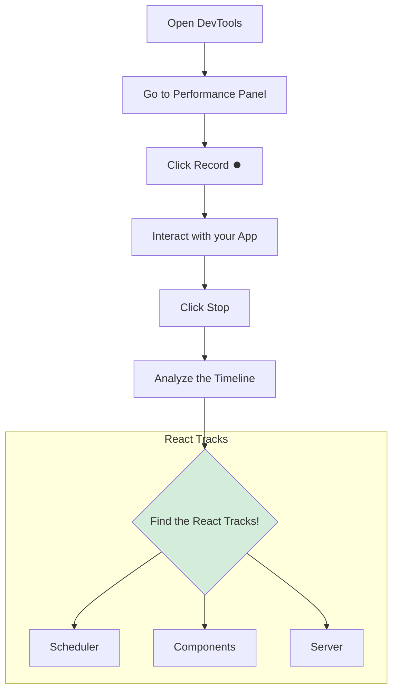

# How to Use: Finding the Performance Tracks 🛠️

Hey mawa! Manam ippati varaku a a tracks unnayo, avi em chesthayo nerchukunnam. Mari, vaatini actual ga chudali ante em cheyyali? Here's a simple step-by-step guide.

**Pre-requisite:** Make sure you are running your React app in **development mode**. Ee tracks production builds lo kanipinchavu.

### Step 1: Open Browser Developer Tools

Mee browser lo, right-click chesi, "Inspect" select cheskondi, or `Ctrl+Shift+I` (or `Cmd+Option+I` on Mac) press cheyyandi.

### Step 2: Go to the "Performance" Panel

Developer Tools lo, chala tabs untayi (`Elements`, `Console`, `Sources`, etc.). Andulo, **"Performance"** ane tab ni select cheskondi.

### Step 3: Record a Performance Profile

Performance panel lopaala, meeku oka "Record" button (oka chinna circle ⏺️) kanipisthundi.
1.  **Click the Record button** to start profiling.
2.  Ippudu, mee app lo a a interaction ni meeru analyze cheyyali anukuntunnaro, adi cheyyandi. (e.g., oka button click cheyyadam, oka form submit cheyyadam, page load avvadam).
3.  Konni seconds tarvata, **click the "Stop" button**.

### Step 4: Find the React Performance Tracks

Profiling stop cheyagane, Performance panel lopaala chala data tho oka timeline generate avuthundi. Ee timeline lo, meeru konchem kindaki scroll chesthe, meeku kottha sections kanipisthayi:

*   **Timings (React)**
*   **Scheduler (React)**
*   **Components (React)**
*   **Server (React)** (if you are using Server Components)

Ave mana React Performance Tracks!

### Tips for Good Profiling

*   **Keep it Short:** Oke recording lo chala ekkuva actions cheyyakandi. Oka specific interaction (like one button click) ni matrame record cheyyadaniki try cheyyandi.
*   **Zoom In:** Timeline chala peddaga unte, mouse wheel tho or timeline paina unna slider tho zoom in chesi, specific events ni chudandi.
*   **Look for Long Bars:** Performance flamegraphs lo, eppudu "long bars" (ekkuva time theeskune operations) kosam vetakali. Ave mana main bottlenecks.

Ee tool tho konchem practice chesthe, meeru mee React app loni performance issues ni chala easy ga, oka pro laaga debug cheyyagalaru! Happy profiling! 🕵️‍♂️🚀