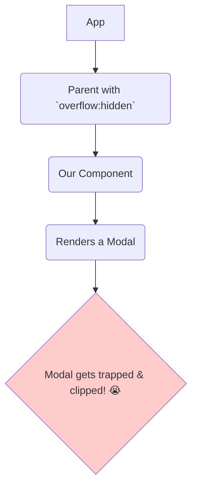

# The Problem: My Modal is Trapped! 갇

Hey friend! Mana app lo, prathi component daani parent lopaala render avuthundi. Idi HTML lo oka tree structure la form avuthundi.

```html
<!-- DOM Tree -->
<div class="app">
  <div class="sidebar">
    <!-- ... -->
  </div>
  <div class="main-content">
    <div class="user-profile">
      <!-- Our component renders here -->
    </div>
  </div>
</div>
```

Ee approach simple gane untundi, kani konni sarlu idi oka pedda problem ni create chesthundi.

Imagine, manam `user-profile` component lopaala nunchi oka **modal dialog** or a **tooltip** ni chupinchali anukuntunnam.

Ee modal dialog anedi page antha cover chesi, top lo kanipinchali. Kani, daani parent (`user-profile` or `main-content`) ki ilanti CSS styles unte emauthundi?
*   `overflow: hidden`: Parent lopaala fit avvani content antha cut aipothundi.
*   `z-index: 2`: Parent ki oka specific stacking order untundi.

Ee styles valla, mana modal dialog aa parent container lopaala **trap** aipothundi! Adi bayataki vachi, full screen lo kanipinchadu.



**The Challenge:** Manam component ni logically (`user-profile` lopaala) undali anukuntunnam, kani visually (DOM lo) adi page antha top lo, `<body>` tag ki direct child ga undali anukuntunnam.

Ee logical position ni, visual position ni separate cheyyadanike, React manaki oka super powerful tool isthundi: **`createPortal`**.

Ee "teleportation" tool ela pani chesthundo, and ee trapped modal problem ni adi ela solve chesthundo, next chapter lo chuddam! Ready to break free? 🚀➡️