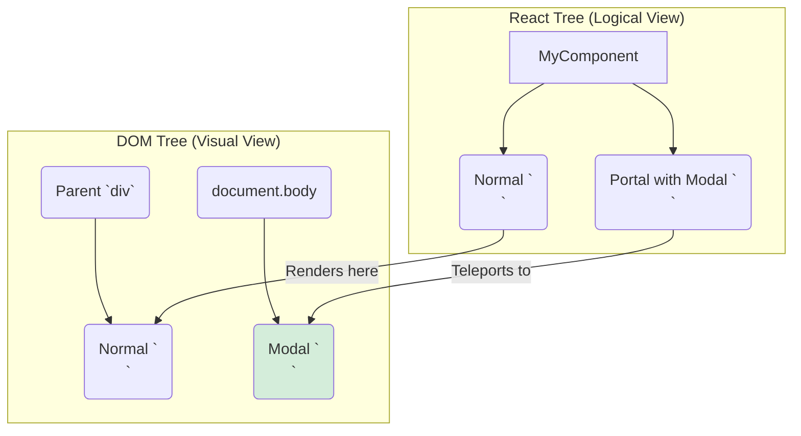

# The Solution: `createPortal` - The Teleporter!  teleport

Hey friend! Last chapter lo manam chusina "trapped modal" problem ki solution eh `createPortal`.

`createPortal` anedi `react-dom` package nunchi vache oka function. Idi mana component యొక్క children ni DOM lo unna vere location ki "teleport" cheyadaniki help chesthundi.

### How does it work?

`createPortal` function rendu arguments theeskuntundi:
1.  **`children`**: Meeru em render cheyyali anukuntunnaro (mee modal, tooltip, etc.).
2.  **`domNode`**: Meeru aa children ni ekkada render cheyyali anukuntunnaro (the destination DOM node). Usually, idi `document.body`.

The syntax looks like this:
`createPortal(children, domNode)`

```jsx
import { createPortal } from 'react-dom';

function MyComponent() {
  return (
    <div className="my-component">
      <p>I am part of the regular component UI.</p>

      {/* Teleport this part to the document body! */}
      {createPortal(
        <div className="my-modal">
          <h2>I am a modal!</h2>
          <p>I live directly inside the body tag.</p>
        </div>,
        document.body
      )}
    </div>
  );
}
```

Ee code tho, `<div className="my-modal">` anedi `<div className="my-component">` lopaala render avvadu. Instead, React daanini teesi, `<body>` tag ki direct child ga peduthundi.

This means, the modal is now free from any `overflow: hidden` or `z-index` issues of its parent components! Problem solved!



Chusara? Logically, modal anedi `MyComponent` loni child eh. Kani physically, adi DOM lo vere chota undi.

Kani ippudu oka interesting question vasthundi. Modal lopaala unna button ni click chesthe, aa event `MyComponent` ki telusthunda? Leka `document.body` ke velthunda? Ee event bubbling magic gurinchi next chapter lo chuddam. It's the coolest part about portals! ✨➡️