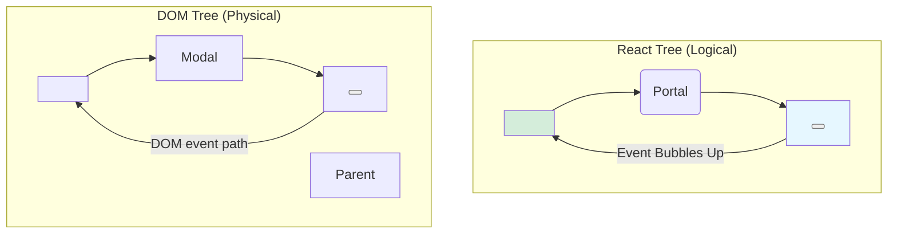

# Event Bubbling: The React Tree is Still the Boss! 👑

Hey friend! Last chapter lo manam oka interesting question tho aagipoyam: "Portal loni button click cheste, aa event ekkadiki velthundi?" ani.

Normal HTML lo, event anedi DOM tree lo paina unna parents ki bubble avuthu velthundi. Kani, mana portal loni UI anedi `document.body` ki child ga undi. So, event anedi `document.body` ki vellipothunda?

**The answer is NO!** And ide `createPortal` loni asalu magic.

> **A portal only changes the DOM position. It does NOT change the React tree position.**

Ante, meeru portal create chesina component, React drushti lo, eppatiki aa portal loni content ki parent eh.

**The Golden Rule of Portal Events:**
> **Events from a portal bubble up to the ancestors in the *React tree*, not the DOM tree.**

So, meeru modal (portal) lopaala unna button ni click cheste, aa event ventane `MyComponent` (the component that called `createPortal`) ki bubble avuthundi!

```jsx
function MyComponent() {
  const handleClick = () => {
    console.log('Event reached the React parent!');
  };

  return (
    <div onClick={handleClick}>
      <p>Clicking here will trigger the handler.</p>
      {createPortal(
        <div className="my-modal">
          <button>
            Clicking this button will ALSO trigger the handler!
          </button>
        </div>,
        document.body
      )}
    </div>
  );
}
```

Ee behavior chala powerful. Ante, mana modal daani parent component tho state share cheskovacchu, data ni update cheyyochu, anni cheyyochu, just like a normal child component.

### Visualizing the Event Path



Ee diagram lo chudandi, event anedi logical React parent ki velthundi, physical DOM parent ki kadu.

Ee concept tho, manam `createPortal` ni master chesinatte. Ippudu, ee concepts anni kalipi - modal create cheyyadam, event bubbling chudatam - anni oke chota code examples lo chuddam! Let's get to the code! 💻🚀