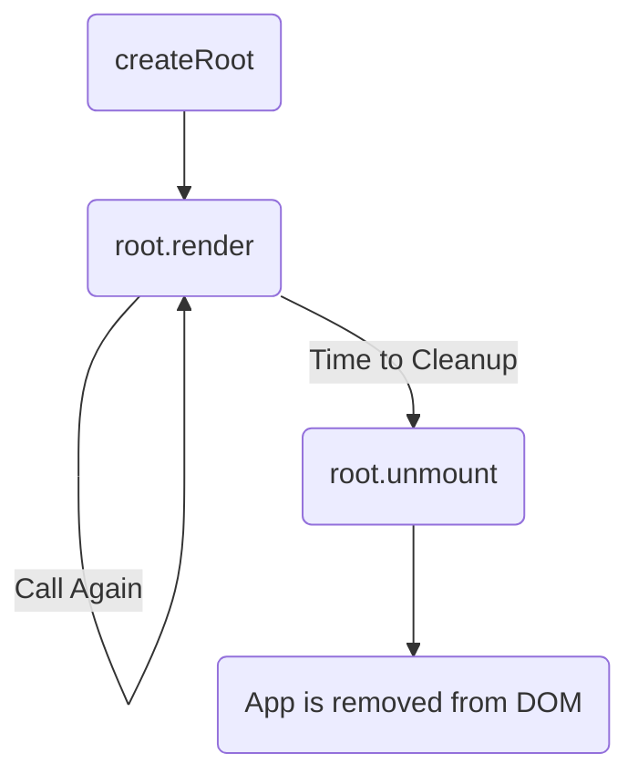

# Updating and Unmounting: The Root's Lifecycle 🔄❌

Hey mawa! Manam `createRoot` tho app ni ela render cheyyalo chusam. Kani, aa root create chesaka, daanitho inka em cheyyochu? Rendu important operations unnayi: **updating** and **unmounting**.

### Updating a Rendered Component

Okasari manam `root.render(<App />)` ani call chesaka, malli ade `root` object meeda `render()` ni call cheyyochu.

```jsx
// First render
root.render(<App title="Welcome!" />);

// Sometime later, call render again on the SAME root
root.render(<App title="Hello Again!" />);
```

**Ee second call em chesthundi?**
React chala smart ga untundi. Adi page antha malli create cheyyadu. Adi pata component tree ni, kottha component tree ni compare chesi, kevalam maarina parts ni matrame update chesthundi. Ee process ni **"reconciliation"** antaru.

**Important Note:** Ee pattern (`root.render` ni multiple times call cheyyadam) anedi chala **rare**. 99.9% of the time, manam app ni update cheyyadaniki component lopaala **state (`useState`)** vadatham. `root.render` ni malli call cheyyadam anedi kevalam konni specific cases lo, especially React ni vere non-React applications tho integrate chesetappudu matrame use avuthundi.

### Unmounting the App

`unmount()` method anedi mana React app ni DOM nunchi completely teesi veyyadaniki use avuthundi. Idi component loni state, event handlers, anni clean up chesthundi.

```jsx
// Completely remove the React app from the <div id="root">
root.unmount();
```

**Eppudu vadali?**
Idi kuda chala rare. Normal full-page React apps lo, manam deenini asalu vadamu. Kani, imagine mana React component anedi oka jQuery tab widget lopaala undi. User aa tab ni close chesinappudu, aa jQuery code mana component unna `div` ni DOM nunchi teesesthundi.

Ala DOM nunchi teese mundu, manam `root.unmount()` ni call cheyyali. Leka pothe, React ki aa component poyindani teliyadu, and adi memory leaks ki daari tiyyochu. So, `unmount` anedi oka **cleanup** tool laantidi.

### Visualizing the Lifecycle



Ippudu, ee concepts anni - creating, updating, and unmounting - oka simple code example lo chuddam. Let's see the full lifecycle in action! 🎬➡️