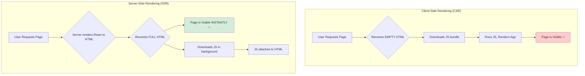

# The Problem: The Blank Page & The Magic of SSR 📜

Hey mawa! Manam `createRoot` gurinchi matladukunnappudu, adi oka empty `

` ni theeskuni, daani lopaala mana app ni render chesthundani chusam.

Ee approach (Client-Side Rendering or CSR) tho oka pedda problem undi.
1.  User mana website ki vachinappudu, browser ki mundu oka **empty HTML page** velthundi.
2.  Tarvata, browser mana app యొక్క pedda JavaScript file ni download cheyyali.
3.  Aa JavaScript download ayyi, run ayyaka, React app ni render cheyyadam start chesthundi.

Ee process antha ayyevaraku, user ki **oka khaali (blank) page** matrame kanipisthundi. Idi slow internet connections lo chala bad experience isthundi.

### The Solution: Server-Side Rendering (SSR)

Ee "blank page" problem ni solve cheyadanike, manam **Server-Side Rendering (SSR)** ane technique vadatham.

SSR lo, manam mana React component ni client (browser) lo kadu, **server lone** render chestham. Server mana component ni theeskuni, daanini plain HTML laaga marchi, aa full HTML ni browser ki pampisthundi.

**The result?** User ki page load avvagane, content antha kanipisthundi! No more blank page. App chala fast ga load ayinattu anipisthundi.

### The New Problem: The "Lifeless" HTML

SSR tho manaki full HTML vachesindi, kani adi kevalam "look" matrame. Adi oka "lifeless" statue (pranam leni vigraham) laantidi. Daaniki elanti interactivity (event handlers, state) undadu.

Manam aa static HTML ki pranam poyali. React ni theeskuni, aa existing HTML ki attach chesi, daanini interactive ga cheyyali.

Ee "pranam poyadam" process eh **"Hydration"**. And daanikosame manam `hydrateRoot` ni vadatham. Adento, next chuddam! 💧➡️