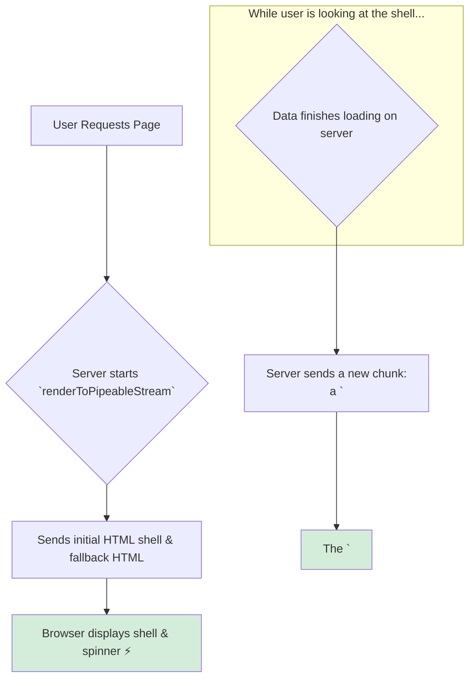

# `renderToPipeableStream`: The Modern Way to SSR! 🌊

Hey mawa! Manam `renderToString` gurinchi matladukunnappudu, adi synchronous and blocking ani chusam. Ante, data antha load ayye varaku user ki em kanipinchadu. Ee problem ni solve cheyadanike, React manaki **streaming** APIs ni ichindi.

Node.js environments kosam, aa modern, recommended streaming API eh `renderToPipeableStream`.

### What is a "Stream"?

Imagine, meeru oka pedda movie ni download chestunnaru. Movie antha download ayyaka chudatam oka option. Leda, download avuthundagane chudatam (streaming) inko option. Streaming valla, meeru ventane movie chudatam start cheyyochu.

`renderToPipeableStream` kuda anthe. Idi mee app యొక్క HTML antha oke sari generate cheyyakunda, daanini **chunks (mukkalu mukkalu ga)** browser ki pampisthundi.

### How `renderToPipeableStream` Works with Suspense

Ee streaming approach, `<Suspense>` tho kalisi oka magic la pani chesthundi.
1.  **Initial Shell:** `renderToPipeableStream` munduga mee app యొక్క "shell" ni render chesthundi. Shell ante, `<Suspense>` boundaries bayata unna content antha. Ee shell ventane browser ki vellipothundi.
2.  **Fallback HTML:** `<Suspense>` boundary lopaala unna content inka data load chesthunte, React daani badulu mee `fallback` (e.g., a loading spinner) యొక్క HTML ni pampisthundi.
3.  **Streaming Content:** Server lo data load avvagane, React aa data tho render chesina kottha HTML ni, and aa fallback ni ee kottha HTML tho replace cheyyadaniki oka chinna inline `<script>` tag ni, oke chunk lo browser ki pampisthundi.

**The result?** User ki page ventane load ayinattu kanipisthundi. Vaallu initial content ni chusthu undagane, migatha parts background lo load ayyi, okkokkati ga appear avuthayi. This is the best possible user experience for complex apps.

`renderToString` anedi pata, slow, "download-then-watch" movie laantidi. `renderToPipeableStream` anedi modern, fast, "watch-while-you-download" Netflix laantidi!

Ippudu, ee powerful API ni oka conceptual server example lo ela set cheyyalo chuddam. Let's get streaming! 🚀➡️