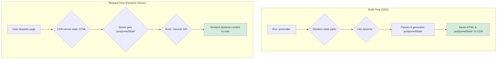

# Static APIs: Build Time lo Magic Cheyyadam 🪄

Hey mawa! Manam ippati varaku Server-Side Rendering (SSR) gurinchi chusam. SSR lo, user page ni request chesinappudu, server aa page ni render chesi pampisthundi.

Kani, inko powerful approach undi: **Static Site Generation (SSG)**.

### SSR vs. SSG: The Core Difference

*   **SSR (Server-Side Rendering):** HTML is generated **on-demand, at request time**. Prathi user ki, server malli render chesthundi.
*   **SSG (Static Site Generation):** HTML is generated **ahead of time, at build time**. App ni build chesetappude, manam anni pages ki HTML files create chesi, vaatini CDN (Content Delivery Network) lo petti, serve chestham.

SSG valla websites incredibly fast ga untayi, endukante server lo elanti rendering pani undadu. Already ready ga unna HTML file ni serve cheyyadame.

### The `react-dom/static` APIs

Ee SSG process ni support cheyadanike, React manaki `react-dom/static` ane package lo konni special APIs isthundi.

1.  **`prerender`**:
    *   **What it does:** Idi "prerenders" a page. Ante, adi mee component ni theeskuni, daanini static HTML laaga render chesthundi.
    *   **When it runs:** During your **build process**.
    *   **Special Power:** `prerender` chala smart. Adi mee component lopaala dynamic content (`<Suspense>` boundary) ni chusinappudu, adi rendering ni **pause** chesi, a a "paused state" ni oka object la isthundi.

2.  **`resume`** (from `react-dom/server`):
    *   **What it does:** Idi `prerender` generate chesina "paused state" ni theeskuni, rendering ni **continue** chesthundi.
    *   **When it runs:** At **request time**, on a dynamic server (like an edge function).

### The Relay Race Analogy 🏃‍♀️🏃‍♂️

Ee process ni manam oka relay race la oohinchukovachu:
*   **The Build Server (First Runner):** `prerender` ni use chesi, race start chesthundi. Static content antha generate chesi, dynamic content daggaraki రాగానే aagi, baton (`postponedState`) ni ready ga peduthundi.
*   **The Edge Server (Second Runner):** User page ni request chesinappudu, ee server vachi, aa baton ni theeskuni, `resume` tho race ni continue chesi, final dynamic HTML ni user ki pampisthundi.

Ee advanced pattern valla, manam static sites యొక్క speed ni, dynamic apps యొక్క power ni combine cheyyochu.

Ippudu, ee `prerender` and `resume` functions ni detail ga chuddam. Let's go! 🚀➡️