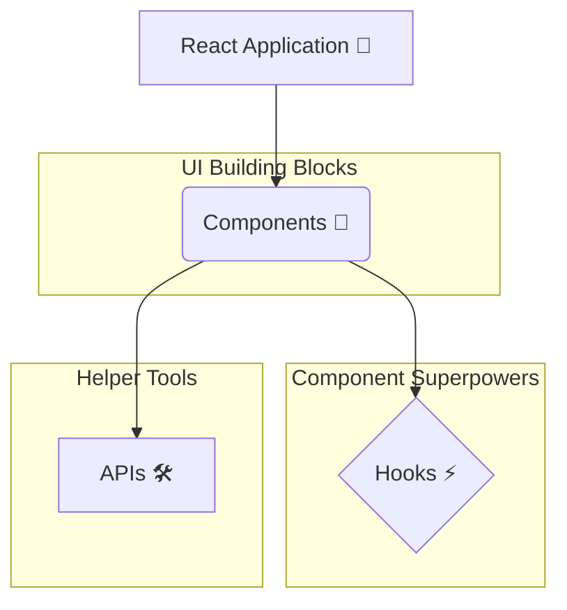

# React ante ఏంటి? Mana Journey Modalaindi! 👋

Hey friend! Welcome to our React learning adventure! 🚀

Ee series lo manam React concepts ni chala simple ga, mana friend daggar nunchi nerchukunnattu nerchukuntam. Nenu English documentation chusi, neeku telugu lo, manaki ardham ayye bhasha lo explain chesthanu. So, ready ah? Let's begin! 🎉

## Asal React ante enti? 🤔

Simple ga cheppalante, **React anedi User Interfaces (UIs) build cheyyadaniki use chese oka JavaScript library.**

"Abba, malli pedda pedda padalu vaduthunnav anukoku." 😂 Let's break it down:

*   **User Interface (UI):** Idi manam screen meeda chuseది. For example, buttons, text boxes, images, full web page - antha UI kindake vasthundi. Basically, user interact ayye ప్రతీ element.
*   **Library:** Idi ready-made code anamata. Manam kashtapadi antha code rayakunda, React manaki konni tools (building blocks lantiవి) isthundi. Manam వాటిని use cheskuni fast ga, efficient ga UI ni build cheyyochu.

Imagine building a house. Instead of making each brick from scratch, you get high-quality, ready-made bricks. React is like that factory that gives you awesome bricks (we call them **Components**). You just assemble them to build your beautiful house (your web application). 🏠✨

## Ee Overview lo Em Nerchukuntam?

Ee section lo manam React "Big Picture" ni chustham. Ante, main building blocks enti, avi ela kalisi pani chestayo ani.

*   **Components:** React lo anni components eh. UI ni chinnaga, reusable pieces ga ela break cheyalo chustham.
*   **Hooks:** Components ki special powers ⚡️ iche functions. For example, data ni "remember" cheskodaniki or external systems tho connect avvadaniki.
*   **APIs:** React lo components define cheyyadaniki or other cool features use cheskodaniki manaki help chese tools.

Don't worry, ippudu ee perlu chusi confuse avvaku. Manam ప్రతి దాని gurinchi detail ga matladukuntam. For now, just get a feel for the main parts.

Here's a simple diagram to show how they relate:

That's it for our introduction! I hope you're feeling excited. 😊

Next, manam React lo atni kante important aina concept, **Components** gurinchi matladukundam. Adi lekunda React ledu! 😉 Ready for the next step? Let's go! ➡️