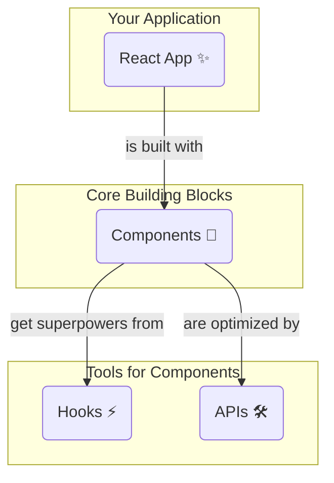

# APIs: Mana Helper Tools 🛠️

Hey, last stop on our overview tour! Manam Components (building blocks 🧱) and Hooks (superpowers ⚡️) gurinchi telusukunnam.

Ippudu manam **APIs** gurinchi matladukundam. Ee peru vinagane bhayapadaku, idi chala simple concept eh.

## React lo APIs ante enti?

React APIs anevi manaki React eh ichina konni powerful functions. Eevi components define cheyyadaniki, performance optimize cheyyadaniki, and other specific tasks cheyyadaniki help chesthai.

Think of them as specialized tools in your toolbox. Hook anedi component *lopala* use chese tool. API anedi component *baita* or *tho paatu* use chese tool anamata.

## Konni Important APIs (Just for a glance!)

Manam ippudu deenilo deep ga vellam, kani neeku oka idea raavadaniki konni examples chuddam.

*   `memo`: Idi oka component ni "memorize" (gurtu pettukomanu) chepthundi. Input props maarithe thappa, aa component malli re-render avvadu. Idi performance ni baaga improve chesthundi.

*   `lazy`: Idi component code ni avasaram ainappude load cheyyadaniki help chesthundi. App initial load time ni thaggisthundi. User aa component ni chuse varaku, daani code download avvadu.

*   `createContext`: Manam `useContext` Hook gurinchi matladukunnam kadha? Aa context ni create cheyyadaniki ee API vadatham.

*   `forwardRef`: Parent component nunchi child component ki `ref` ni pass cheyyadaniki idi use avuthundi. (Don't worry about `ref` for now, manam tarvata nerchukuntam).

Ee APIs anni mana application ni more efficient, powerful, and organized ga cheyyadaniki help chesthai.

## Final Picture!

So, ippudu manaki complete picture vachindi anukuntunna.

And that's it! Mana React Overview tour mugisindi! 🎉🎉

You now have a high-level understanding of:
1.  **Components:** The UI building blocks.
2.  **Hooks:** Functions that give superpowers to components.
3.  **APIs:** Helper tools to create and optimize components.

Ippudu manam theory nunchi practical ki jump cheddam. Manam matladukunna ee concepts ni chupinche konni simple code examples ni create cheddam. Ready to see some code? Let's go! 💻🔥