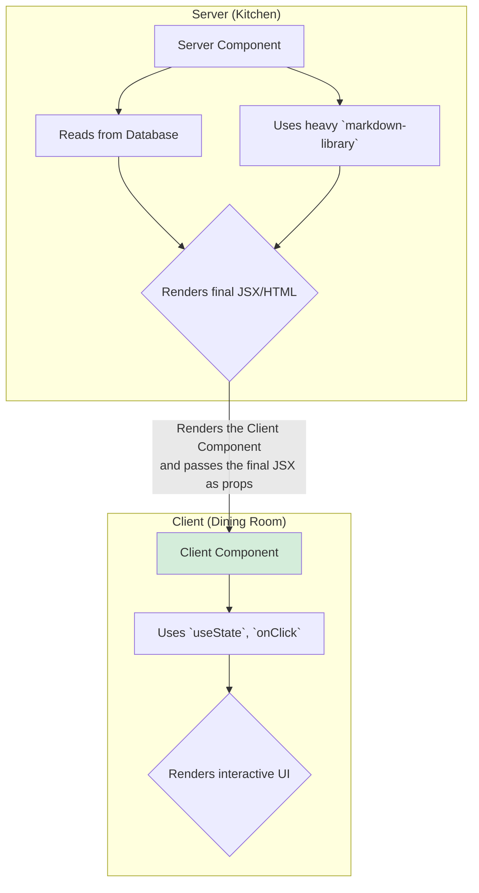

# Server Components: The Best of Both Worlds 🤝

Hey mawa! Manam ippati varaku matladukunna components anni browser lo run avuthayi. Vaatini manam "Client Components" antam. Client Components valla mana app chala interactive ga untundi.

Kani, Client Components tho oka pedda problem undi: **vaati code antha user download cheskovali.** Pedda pedda libraries (`marked`, `sanitize-html`) vadithe, mana app bundle size perigipothundi, and app slow avuthundi.

Inko approach Server-Side Rendering (SSR). Ikkada HTML antha server lo generate avuthundi. Idi fast eh, kani interactivity add cheyyadaniki malli client lo hydration cheyyali.

Ee rendu approaches loni best parts ni theeskuni, kottha, powerful model create chesaru. Ade **React Server Components (RSC)**.

### What are Server Components?

> **Server Components are React components that run *exclusively* on the server.**

Vaati code eppudu browser ki pampabadadu. Vaati output (the final JSX/HTML) matrame client ki velthundi.

**Analogy: The Restaurant Kitchen vs. The Dining Room 🧑‍🍳➡️💁‍♂️**
*   **The Server (Kitchen):** Ikkada chala panimuttu (`node:fs`, database connection, heavy libraries) untayi. **Server Components** ee kitchen loni chefs laantivi. Vaallu ee panimuttu antha use chesi, final dish (JSX) ni prepare chestaru.
*   **The Client (Dining Room):** Ikkada kevalam serve cheyyadaniki kavalsina chinna chinna items matrame untayi. **Client Components** ee dining room loni waiters laantivi. Vaallu kitchen nunchi vachina dish ni theeskuni, user ki andamga present chesi, user tho interact avutharu (`onClick`, `useState`).

Server Components valla, manam heavy libraries ni, data fetching logic ni, and sensitive code ni antha server ke parimitham cheyyochu. Deeni valla, client ki velle JavaScript bundle size chala chinnaga untundi.

### The Default is Now Server

The most important thing to remember is:
> **With this new model, every component is a Server Component *by default*.**

Manam oka component ni Client Component ga cheyyali ante, manam daaniki **`'use client'`** ane oka special directive ni add cheyyali. Ee directive eh server ki client ki madhyalo unna "magic door".

Ee `'use client'` boundary gurinchi, and ee rendu type of components ela kalisi pani chesthayo, next chapter lo chuddam. This is the core of the new React architecture! Let's go! 🚀🚪