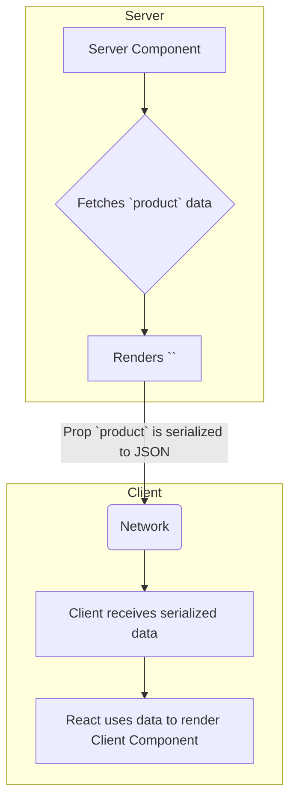

# Server + Client: Working Together 🤝

Hey mawa! Manam ippati varaku Server Components (SC) and Client Components (CC) gurinchi veru veru ga matladukunnam. Kani, real-world apps lo, ee rendu kalise pani chesthayi. Ee "interleaving" pattern eh React Server Components యొక్క asalu power.

### The Golden Rule of Composition

The most important rule to remember is:
> **A Server Component can import and render a Client Component.**

Idi one-way street laantidi. Manam server (non-interactive) nunchi client (interactive) loki vellagalam.

```jsx
// --- ProductPage.jsx (Server Component) ---
import db from './database.js';
import AddToCartButton from './AddToCartButton.jsx'; // A Client Component

export default async function ProductPage({ id }) {
  // 1. Fetch data on the server
  const product = await db.products.get(id);

  return (
    <div>
      <h1>{product.name}</h1>
      <p>{product.description}</p>

      {/* 2. Render a Client Component and pass server data as props */}
      <AddToCartButton productID={product.id} />
    </div>
  );
}


// --- AddToCartButton.jsx (Client Component) ---
'use client';
import { useState } from 'react';

export default function AddToCartButton({ productID }) {
  const [isAdding, setIsAdding] = useState(false);

  const handleClick = () => {
    setIsAdding(true);
    // ... call an API to add to cart ...
  };

  return (
    <button onClick={handleClick} disabled={isAdding}>
      {isAdding ? 'Adding...' : 'Add to Cart'}
    </button>
  );
}
```

Ee example lo, `ProductPage` (SC) anedi server lo render ayyi, data fetch chesi, `AddToCartButton` (CC) ni render chesthundi. The button itself, with its state and click handler, will run on the client.

### The "Serialization" Boundary

Server nunchi client ki data pampetappudu, manam oka important rule gurtupettukovali.
> **Props passed from a Server Component to a Client Component must be "serializable".**

**"Serializable" ante enti?**
Ante, aa data ni text (JSON string) laaga marchi, network lo pampinchi, client lo malli object laaga reconstruct cheyyagalagali.

**What is serializable?**
*   Primitives: `string`, `number`, `boolean`, `null`
*   Plain Objects: `{ name: 'Mawa' }`
*   Arrays containing serializable values.
*   `Date` objects, `Map`, `Set`.

**What is NOT serializable?**
*   **Functions!** (Except for special Server Actions, which is an advanced topic).
*   Class instances.
*   Values like `undefined` (it will become `null`).

So, meeru server nunchi client ki `onClick` handler lanti function ni prop ga pass cheyyaleరు. All interactivity must be defined *inside* the Client Component.



Ee Server/Client model ni ardham cheskunte, manam chala efficient and performant apps build cheyyochu. We get the best of both worlds: fast initial loads from the server, and rich interactivity on the client.

Ippudu, ee concepts anni kalipi, oka full example lo chuddam! Let's go! 💻🚀